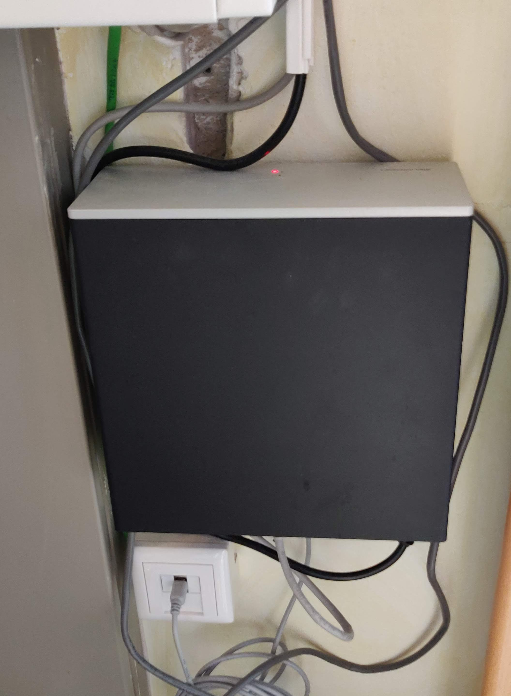
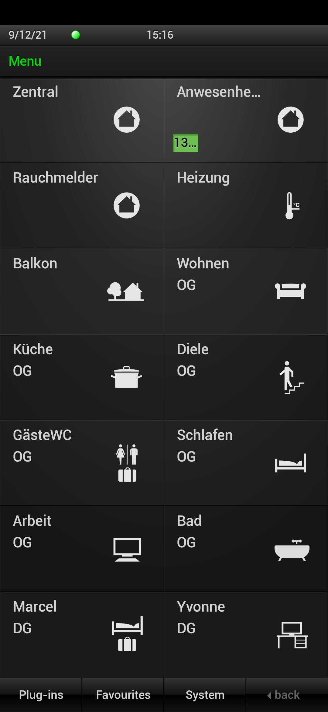
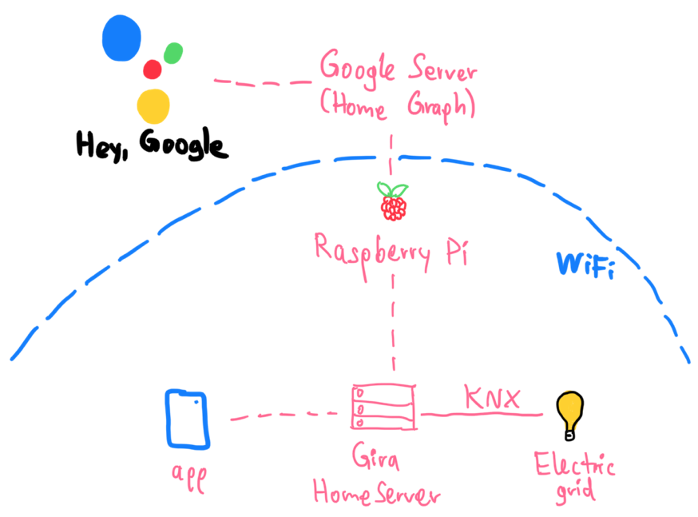

topics: tinkering with the Gira HomeServer, Dart, code

# Reverse Engineering the Gira HomeServer
## How I inspected our home

We have a pretty fancy home:
There are extra wires in the walls used as a [KNX](https://www.knx.org) bus – a system to control lights, thermostats, shades, and power outlets in our home.
All *devices and switches contain a microcontroller that can send and receive messages* using the KNX bus wire.
For example, light switches emit messages for turning a light on or off, and lamp sockets listen for those commands to turn the lamp's electricity on and off.

Compared to traditional cabling approaches, this is more flexible because switches can be added anywhere on the bus without requiring re-cabling – we could add a button that toggles lights on the other side of the house.
Here's a comparison of how the cabling looks like:

!invertible[Conventional multi-switch vs. bus system](files/gira-knx-bus.webp)

...

A system such as this also opens up the possibility of *automation*:
If you hook a computer up to the KNX bus, it can track which lights are turned on and off and control all devices in the home.
Contrary to the recent wave of "smart home" devices, this works entirely locally without any internet connection.
And cheaper "dumb" lamps are perfectly fine to buy because the electric grid itself is intelligent.

In April 2017, we got a [Gira HomeServer](https://www.gira.com/en/en/products/lighting-control/app-controlled-lighting/gira-homeserver), which is a computer that connects to both the KNX bus wire as well as our local network.
Here's an image of it sitting in a closet:



The server enables us to control everything using [an app](https://play.google.com/store/apps/details?id=de.gira.homeserver.android):



The app looks a _bit_ dated, so naturally, I tried to write a new app for it.
Let the reverse engineering begin!

## Reverse engineering how the app talks to the Gira HomeServer

First, I installed the [Gira HomeServer app](https://play.google.com/store/apps/details?id=de.gira.homeserver.android) on an Android emulator and looked at the communication happening between the app and the server sitting in our home.
This server listens for HTTP requests to the path `path:/QUAD/LOGIN` and then communicates using a strange protocol.
Here's a part of the setup communication – the app developers were really into the pipe character (`text:|`):

```text
<- 100||
-> 90|Marcel|
<- 91|245013621|
-> 92|A335F32830EAFB1534DE46EFEECF1A8C|
<- 93|1631189318.7.777.284968294|1623684493.49|1|10||000AB3026D30|20170718095820834
-> 1|18039|1
<- 1|18039|1.0|0
<- 1|15883|718.0|0
<- 1|18086|1.0|0
<- 1|18039|1.0|0
<- 1|15883|719.0|0
-> 94||
<- 2|18037|0.0|0
<- 2|18038|0.0|0
<- ...
-> 1|18039|0
<- ...
```

Each message has a *type* (the `text:100`, `text:90`, `text:91` etc.) and then some *arguments*.
After some careful testing and matching doing things in the app with what gets sent, I figured out the meaning of most messages:

- `text:100`: The server asks for a username.
- `text:90`: The client provides that username.
- `text:91`: The server asks for a password hash using the given salt (a random string of characters).
- `text:92`: The client authenticates using the hash.
- `text:93`: The authentication was successful.

*Salted password hashing* is used so that other devices listening on the WiFi can't pick up the password.
The server thinks of some random characters, and both the server and the client do complicated irreversible math on both the salt and the password.
The client only responds with the password hash.
What would happen if malicious devices that don't know the password attempt to connect to the server?
It would give them a different salt, so they can't do the calculation themselves and can't respond with the correct hash.

I extracted the math for calculating the hash by decompiling the HomeServer Android app.
It doesn't look like a well-established cryptography algorithm, though, and makes heavy use of the [cryptographically insecure MD5 hashing function](https://en.wikipedia.org/wiki/MD5).
Here's a version of the hash function written in [Dart](https://dart.dev):

```dart
String _createHash(String username, String password, String saltString) {
  final salt = saltString.encodeUtf8();
  final a = [for (var i = 0; i < 64; i++) salt.at(i, or: 0) ^ 92].decodeUtf8();
  final b = [for (var i = 0; i < 64; i++) salt.at(i, or: 0) ^ 54].decodeUtf8();
  var hash = md5('$b$username$password'.encodeUtf8()).bytes.encodeHex().toUpperCase();
  return md5('$a$hash'.encodeUtf8()).bytes.encodeHex().toUpperCase();
}
```

After this authentication process, the client can send a type `text:1` message with a device ID and a state.
The server receiving this message will change the state of the physical device.
For example, `text:1|18039|1` corresponds to "Set the device with ID 18039 (our kitchen light) to status 1 (on)."

In natural language, the whole conversation looks something like this:

!invertible[comic](files/gira-comic.webp)

By default, the server sends all device changes to the client – that's why the server responds with confirmation messages in the transcript above.
Using the message `text:94`, the client can also explicitly request an update of all device states.

I used the received device updates to create a mapping from our devices to their IDs.
Some devices, like shutters, also consist of multiple IDs – turning one ID on or off makes it go up or down, and setting the other stops the shade.
(Yes, that feels like an ugly workaround.)

Given that I can now control our home devices, it's time to get working on the new app!

## A better app

I wrote a simple app in [Flutter](https://flutter.dev) that lets us virtually navigate through rooms and toggle the devices in each room.
Unlike in the official app, devices are roughly displayed in a layout that corresponds to their actual placement in the physical world.
It also automatically adjusts the orientation to the real world according to the device's compass:

<center>
<video loop muted autoplay>
  <source src="files/gira-my-app.mp4" type="video/mp4" />
  Your browser does not support the video tag.
</video>
</center>

## Hey Google, turn on the kitchen light.

We have a few [Nest Home devices](https://store.google.com), so I thought it would be a fun exercise to make our devices voice-controlled by integrating them in the Google Assistant.

Google Assistant has the concept of a [Home Graph](https://developers.google.com/assistant/smarthome/concepts/homegraph).
I registered as a smart appliance maker, and in the account settings, I set a *Raspberry Pi server in our WiFi* as the fulfillment backend.
Once I linked the account to our Google Home app, Google sent a request like this to the Raspberry Pi to find out which devices exist:

```json
{
  "requestId": "ff36a3cc-ec34-11e6-b1a0-64510650abcf",
  "inputs": [{ "intent": "action.devices.SYNC" }]
}
```

The Raspberry Pi answers with a list of all devices in our home.
The Google Home Graph supports [over 70 device types](https://developers.google.com/assistant/smarthome/guides) from [air conditioning units](https://developers.google.com/assistant/smarthome/guides/acunit) to [yogurt makers](https://developers.google.com/assistant/smarthome/guides/yogurtmaker).
Each device can also have [traits](https://developers.google.com/assistant/smarthome/traits), which are things you can do with it.
For example, devices that you can toggle on or off have the `text:action.devices.traits.OnOff` trait.
The full answer looks something like this:

```json
{
  "requestId": "ff36a3cc-ec34-11e6-b1a0-64510650abcf",
  "payload": {
    "agentUserId": "1836.15267389",
    "devices": [
      {
        "id": "dg.licht.bad",
        "type": "action.devices.types.LIGHT",
        "traits": ["action.devices.traits.OnOff"],
        "name": { "defaultNames": [], "name": "dg.licht.bad", "nicknames": [] },
        "deviceInfo": { "hwVersion": "1.0", "swVersion": "1.0.0" },
        "willReportState": false
      },
      {
        "id": "dg.rollo.links",
        "type": "action.devices.types.BLINDS",
        "traits": ["action.devices.traits.OpenClose"],
        "name": { "defaultNames": [], "name": "dg.rollo.links", "nicknames": [] },
        "attributes": {
          "discreteOnlyOpenClose": true,
          "openDirection": ["UP"],
          "commandOnlyOpenClose": true
        },
        "deviceInfo": { "hwVersion": "1.0", "swVersion": "1.0.0" },
        "willReportState": false
      },
      {
        "id": "balkon.markise.links",
        "type": "action.devices.types.AWNING",
        "traits": ["action.devices.traits.OpenClose"],
        "name": { "defaultNames": [], "name": "balkon.markise.links", "nicknames": [] },
        "attributes": { "openDirection": ["OUT"], "commandOnlyOpenClose": true },
        "deviceInfo": { "hwVersion": "1.0", "swVersion": "1.0.0" },
        "willReportState": false
      },
      ...
    ]
  }
}
```

Every time the Google Assistant tries to modify or query the state of devices, Google sends a request with a command to the Raspberry Pi.
For example, if we say, "Hey Google, turn on all lights in the bathroom," this command is sent to the Raspberry Pi:

```json
{
  "requestId": "ff36a3cc-ec34-11e6-b1a0-64510650abcf",
  "inputs": [{
    "intent": "action.devices.EXECUTE",
    "payload": {
      "commands": [{
        "devices": [{ "id": "dg.licht.bad" }, { "id": "dg.licht.spiegel" }],
        "execution": [{
          "command": "action.devices.commands.OnOff",
          "params": { "on": true }
        }]
      }]
    }
  }]
}
```

The Raspberry Pi, in turn, communicates directly with the Gira HomeServer and toggles the devices.
Here's the whole architecture of our setup:



## Conclusion

Reverse engineering is fun!
Analyzing network traffic and decompiling apps to figure out how everything works feels like solving a big real-world puzzle.
