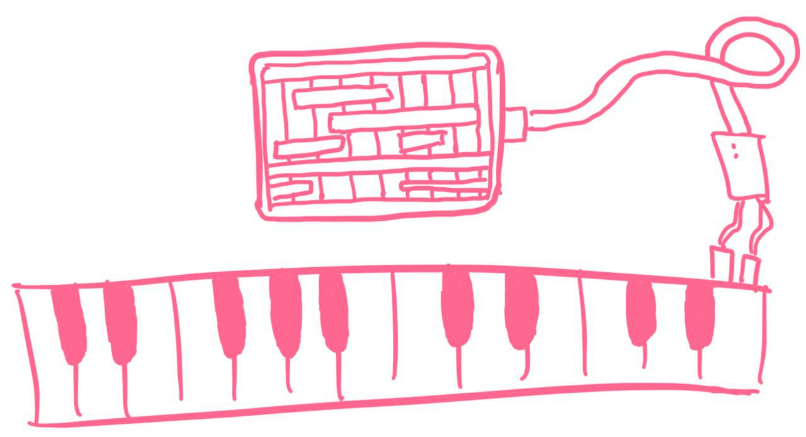

# Making MIDI Music with my electric piano and iPad

I've played piano for a long time, but only recently discovered that my electric piano has a MIDI port at the back!
Using it is a lot of fun: By connecting the piano to my iPad, I can play music *through the iPad.* This allows me to change instruments, and record and arrange music.

--snip--

Here's how arrangements looks like in the GarageBand app:

Of course, some instruments (such as oboe or violin) sound bad, but percussion and plucked instruments generally have a good sampling quality.

Here is an example song making use of different keyboards, drumpads, and effects:

<audio controls src="/jogging-in-the-cold" />

