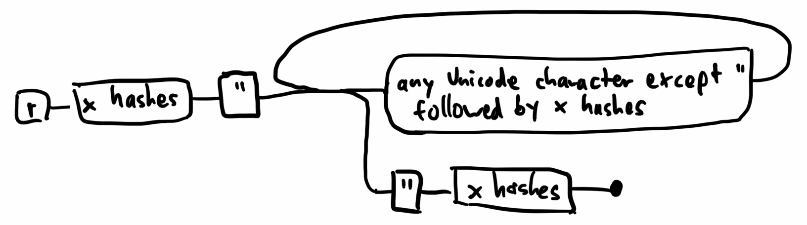
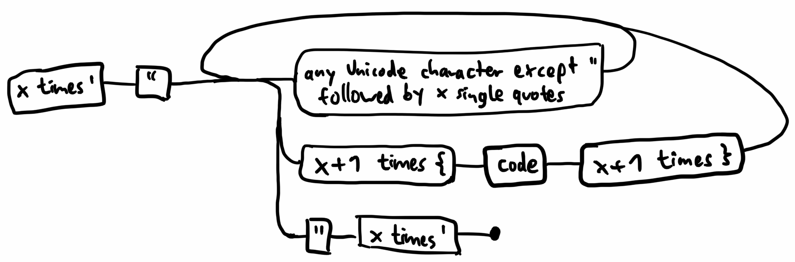

# Meta Strings

Most programming languages have the concept of a string, a representation of text in the program. In some languages, you can even integrate code expressions in strings:

```rust
"Hello, {name}!\n"
```

Special characters like `rust:{` or `rust:\` indicate that the following characters are not part of the string literal itself, but should instead be interpreted in a different way – they are _escape sequences_.

This approach comes with some problems: Now, to actually use `rust:{` or `rust:\` in the string, you have to escape those as well.
This is okay, but makes strings with lots of special characters ugly. For example, to the regex that matches words ending with `\` can be written like `rust:\w\\+`, but inside a string it becomes even more bloated:

```rust
"\\w\\\\+"
```

--snip--

Every level of abstraction doubles the number of escape characters: Regexes have escape characters, and strings escape those as well. If we wanted to write a program that outputs a regex in a JSON object, it would be even more ridiculous: `rust:"\\\\w\\\\\\\\+"`

Some development environments like IntelliJ actually offer a meta-view of a string, where you can edit the raw string and you simultaneously edit the escaped version in your program code.

Rust offers an alternative to these escape sequences: Raw strings!
If you open a string not with `rust:"`, but with `rust:r#"` instead, you can only end the string using `rust:"#`. Even better: How many hash signs (also known as "octothorpes") you put at the beginning, you have to use the same number at the end of the string to close it. Here's this behavior expressed in a state machine:



This means you can copy-paste any content into your program and use it directly in a string without escaping individual characters. Instead, you just slap a bunch of hash signs at the beginning and end, and you're ready to use those bytes you pasted as a string:

```rust
let my_program = r##"
fn main() {
    let name = r#"world"#;
    println!("\"Hello, {}!\", said the program.", name);
}"##;
```

This example also highlights that you can use raw strings inside of other raw strings as long as the outer one is **more meta** than the inner one.

We think about implementing something similar in [Candy](https://github.com/candy-lang/candy): If you start you string with `''"`, it can only be ended with `"''`. You can increase the number of single quotes as needed.

Unlike Rust's raw strings, we also want to also allow string interpolation, as long as the interpolated code is wrapped in the same number of `{` and `}` as there are leading characters:



```txt
"A normal string with {interpolation}, but no double quotes."
'"A meta string can have double quotes. Here's a single one: ""'
'""Hello, {{name}}!" is what I said to {{name}}."'
''"Here's what an empty string looks like: "" This is meta meta!"''
```
