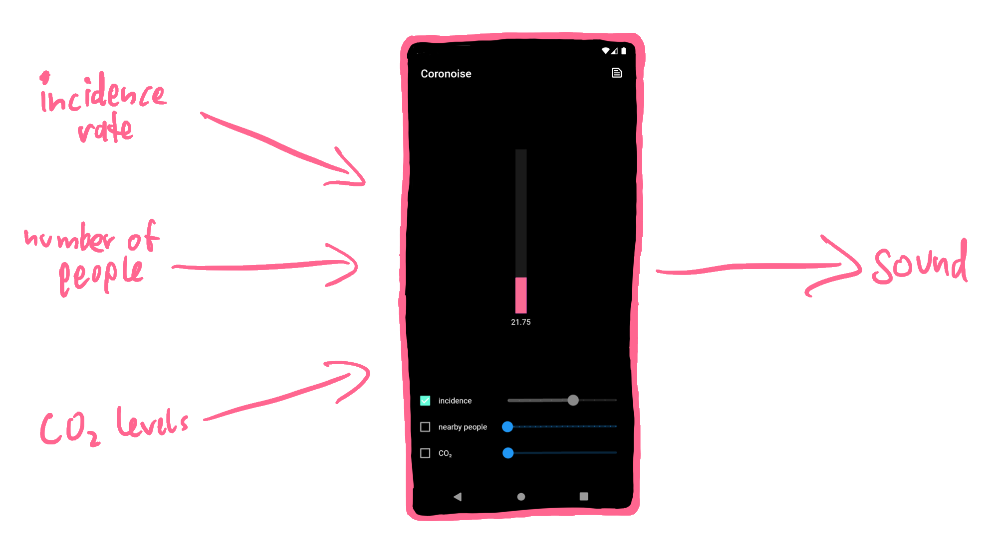
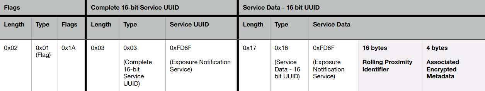
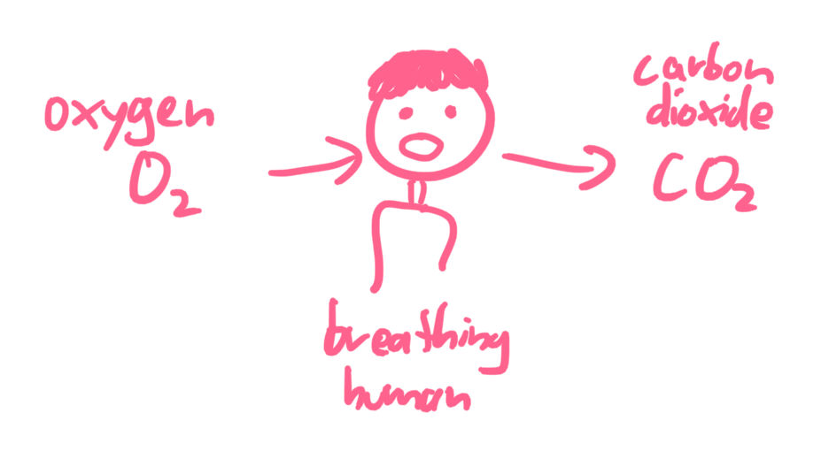
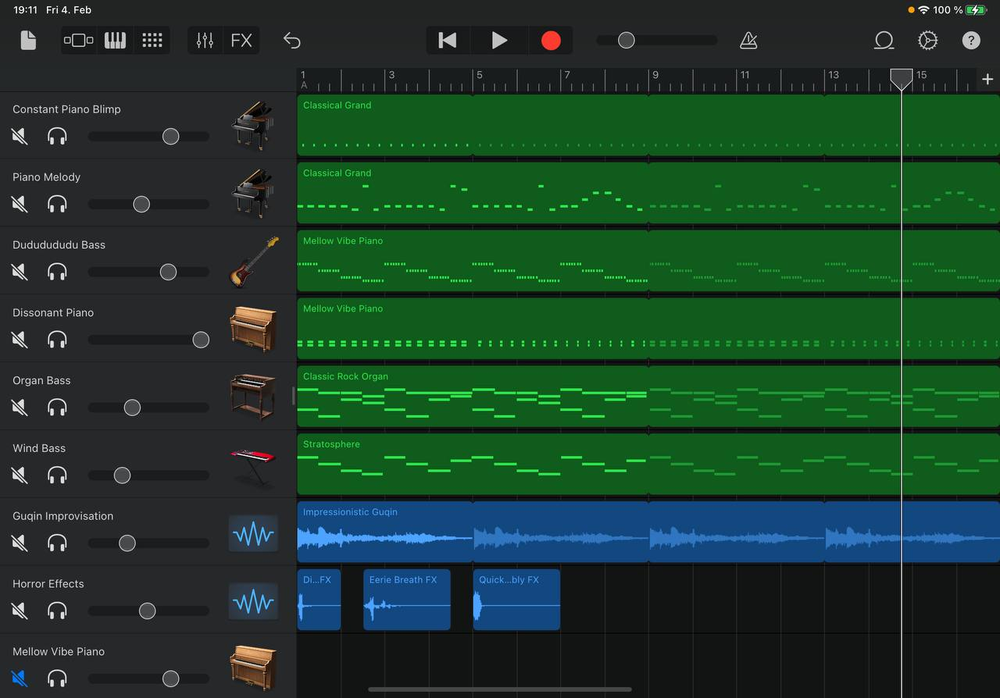
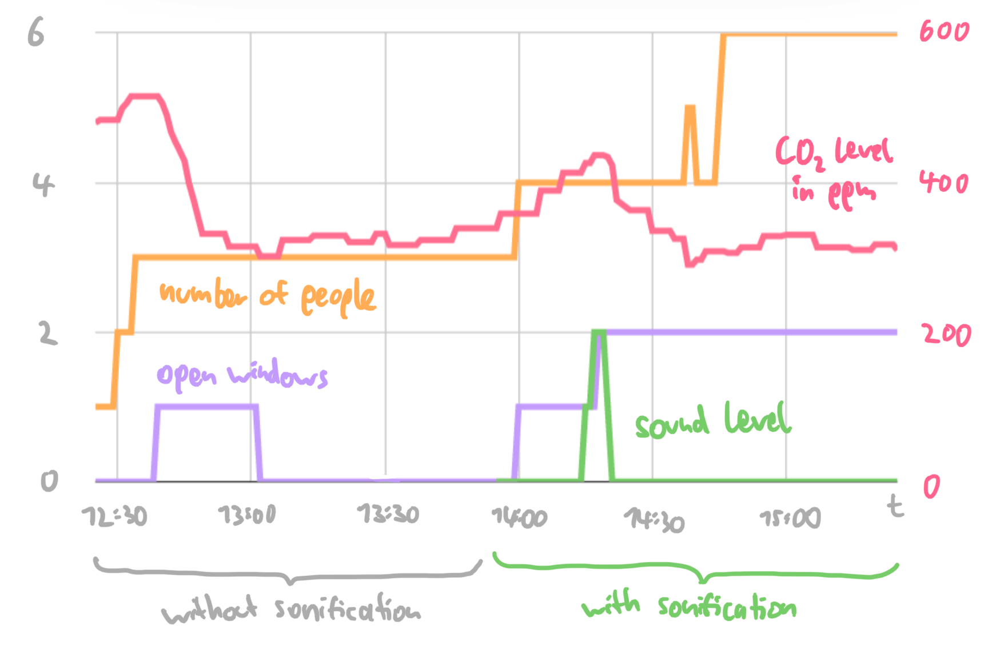

# Encouraging People to Be More Careful in Situations With High Infection Risk

As you might have noticed, we are currently in a pandemic.
Luckily, there are several steps you can take to protect yourself and others: You can get vaccinated, wear a mask, avoid large groups of people, regularly ventilate when being indoors with others, etc.
Some of these measures are easier to follow than others. Getting vaccinated is a one-off action, but remembering to open the window every few minutes is a lot harder if you also concentrate on something else, such as working or studying.

In the context of the *Sonic Thinking* and *Neurodesign* lectures at our university, I developed [an app](https://github.com/MarcelGarus/coronoise) that continuously evaluates the current infection risk and turns it into music.

The aspirational goal of the project is to enable scenarios like these:

* You walk into an office that hasn’t been ventilated for a long time. As soon as you step inside, scary music starts to play, like you're in a horror film.
* Over one hour, your study room gradually fills with people. An alarming tune slowly fades in and gets more dissonant the more people there are.



--snip--

The app takes three inputs: the incidence rate in the area, the number of people nearby, and the CO₂ level.
You can adjust each of these inputs manually with a slider, or you can check the box on the left to make the app automatically try to choose an appropriate value.

## Incidence Rate

In Germany, the Robert Koch Institute is a reliable source for infection data.
This data is made available by an API by ArcGIS.
For example, the URL `txt:https://services7.arcgis.com/mOBPykOjAyBO2ZKk/arcgis/rest/services/RKI_Landkreisdaten/FeatureServer/0/query?where=1%3D1&outFields=GEN,EWZ,last_update,cases7_lk&returnGeometry=false&outSR=4326&f=json` answers with a JSON object that contains the name, update time, number of residents, and reported COVID-19 infections for each district.
You can use this information to calculate the incidence rate.

```json
{
  "features": [
    {
      "GEN": "Potsdam",
      "last_update": "05.02.2022, 00:00 Uhr", // ugly timestamp encoding
      "EWZ": 182112,     // number of people ("Einwohnerzahl")
      "cases7_lk": 3298  // COVID-19 cases in the last 7 days
    },
    ...
  ],
  ...
}
```

In this example, the incidence rate in Potsdam is `dart:100000 * cases7_lk / EWZ = 100000 * 3298 / 182112 = 1810.97`.

By setting `rust:returnGeometry=true` in the URL, the API also returns a list of outline coordinates for each district.
Because the response will be enormous (~7 MB, bigger than the app itself) and the task of determining your district is computation-heavy, a more powerful server should take care of this.
For now, I just hardcoded the location to Potsdam.

## Exposure Notifications

In 2020, Apple and Google published an [Exposure Notification Framework](https://developers.google.com/android/exposure-notifications/exposure-notifications-api), which both Android (with Google Play) and iOS implement.
This framework works with government-built Exposure Notification apps, such as the [Corona-Warn-App](https://play.google.com/store/apps/details?id=de.rki.coronawarnapp) in Germany.
It enables smartphones to track encounters and proactively notify their owners if they were near a person later diagnosed to be infected.

The process is anonymous and decentralized:

1. The framework generates a random Temporary Exposure Key every day. From this key, it derives Rotating Proximity Identifiers (RPIs) every 10 – 20 minutes.
2. The operating system broadcasts those RPIs every 200 – 270 milliseconds using Bluetooth Low Energy. The framework remembers which RPIs it received from other devices in the last two weeks.
3. If you are tested positive for COVID-19, you can donate your keys to the public health services. Those then publish all derived RPIs.
4. All Exposure Notification apps will download and compare them against the RPIs they saw and alert their users if they find a match.

A benefit of the framework taking care of the low-level work is that the app doesn't have to run in the background all the time, thereby preserving battery life.

For my use case of estimating the number of people around you right now, this approach won't work though: Instead of "Did I see this person in the last two weeks?" we want to answer "How many people are there around me right now?" Instead of long-term, qualitative measurements, we want to perform time-sensitive, quantitative measurements.

That's why my app *doesn't* talk with the operating system's Exposure Notification Framework. Instead, it uses Bluetooth directly to scan for RPIs.
Roughly every second, it scans all Bluetooth devices nearby and filters for those that are RPIs.
The [Exposure Notification Bluetooth Specification](https://blog.google/documents/70/Exposure_Notification_-_Bluetooth_Specification_v1.2.2.pdf) shows how the layout of a Bluetooth advertisement with an RPI looks like and that they contain a special _Service UUID_ of `text:0xFD6F` that is reserved for RPIs:



Next, I evaluated if the scanning works.
I measured the number of received RPI tokens when shopping in the local supermarket, staying at home, and taking a walk in the forest.
Here are the results:


Don't be fooled: This is a line chart, not a bar chart; the number of scanned tokens really goes up and down like that.
I suppose this is an artifact of Android rate-limiting the app or trying to be clever and not re-scanning for devices every time the app tells it to, which leads to either the same number of RPIs being reported multiple consecutive times or none at all being reported.

**In the supermarket (yellow):**
This measurement contains me browsing the store and then going to the register.
From the increases at the end, you can see that waiting in line with multiple people leads to more RPI tokens.
If you're wondering about the gap in the data: That's just me turning the phone into standby mode while putting items on the cash register tape – for now, the app has to run in the foreground to record data.

**At home (purple):**
The measurements at home report a mostly constant number of notifications.
The noise could result from people going to different rooms, people walking by outdoors, or just the corruption of some Bluetooth packets that get sent threw a few walls.  
This data series also shows that the app isn't perfect for measuring the number of people relevant for the infection risk:
I'm alone in my flat, but because I live in a student residence with many neighbors, four people are reported.
If you're using the app in a room with a fixed number of people for a long time, you should consider manually entering the number of people to benefit from more accurate data.

**In the forest (green):**
For the measurements in the forest, I took a long walk, listened to podcasts on headphones, opened the app in the foreground, and enabled the sonification, so that I'll hear a sound when some RPIs are detected.
I met the occasional hiker, but the higher bump was interesting:
While I was walking down a narrow path, I heard the sound of RPIs being recorded.
I looked around and, fair enough, two bikers were pulling up from behind. I stepped aside and let them pass through. To me, this showed that even a very simple sonification – like turning Exposure Notifications to piano blimps – can be useful in everyday life: If I hadn't used the app, I wouldn't have heard the bikers approaching and they'd have to ring or yell. 

## CO₂ Levels

You might be wondering: Why use CO₂ levels as an indicator?
A hint:



Outdoors, CO₂ levels are usually at 300 – 500 ppm, indoors at 500+ ppm.
Here, ppm stands for *parts per million*, so a value of 400 ppm corresponds to 400 / 1000000 = 0.04 % of the air being CO₂.
Because that extra CO₂ comes primarily from exhaled air, it's unsurprising that Burridge [^co2] found that lower CO₂ levels naturally correlate with measures that protect against COVID-19 infections: increased ventilation, fewer people, and less kinetic strength (a measure of how much movement occurs).
So, CO₂ levels can be a useful indicator for the airborne COVID-19 infection risk.

In 2021, a group of Japanese researchers [^concert] visualized a graph of the CO₂ concentration during a concert and made about half of the audience feel "much safer."
They strongly expect this visualization to become part of the standard operating procedure of concerts.

In the context of the lectures, I didn't manage to programmatically integrate a CO₂ sensor; for now, the CO₂ value needs to be manually entered into the app.

## Sound Generation

Let's shift from inputs to outputs!
While visual indicators are nice, they don't proactively notify you of increased infection risks: Although I have a CO₂ sensor set up above my computer display, I rarely look at it if I'm deeply focused on some programming task.
Instead, I'm often surprised if I look up and see how high the levels are.

Sound, on the other hand, is a sense that proactively comes to us and that can't be easily ignored – that's why alarm clocks make a sound.
My idea was to play scary, spooky sounds that emotionally convey the dangerousness of infections.
Forgetting to open the window for some time would lead to ominous music playing, just like you're in a horror film!

Heimerdinger [^scary] investigated the music of horror movies and found some common factors for creating suspense in sound: sustained high tones, deep drones, annoying repetitive motives, and specific noises such as the howling wind.
I took all of those inspirations and composed a song with multiple voices.
For that, [I connected my electric piano's MIDI output to my iPad](midi-music) and played different instruments through GarageBand:



Here are some of the voices of my arrangement. Feel free to play around with playing them simultaneously:

- Dissonant Piano:  
  <audio controls src="/files/coronoise-song-dissonant-piano.mp3" />
- Accent:  
  <audio controls src="/files/coronoise-song-accent.mp3" />
- Guqin (traditional Chinese instrument):  
  <audio controls src="/files/coronoise-song-guqin.mp3" />

To programmatically combine those instruments, I initially tried to have one control loop that turns instruments on and off.
This became complicated pretty fast – you have to track which instruments are playing on which volume as well as when they started (some should only end at some pre-defined beats or have a minimum amount of time between consecutive activations).
In the end, I settled on an architecture where instruments have access to some ambient values such as the current beat number and the inputs but could do whatever they want on every beat.
This allows me to implement many different types of effects: fade in and out, start and end at predefined beats, start on some beats and then fade out, or randomly start.

Here's what a piece of composed music might sound like if the risk first steadily increases and then decreases again:  
<audio controls src="/files/coronoise-song-full.mp3" />

> **One other tidbit:** First, you only hear one piano note, but as soon as the second instrument starts, you realize the first one was played off-beat. That creates a short moment of disorientation.

## Study

Many papers investigate potential triggers for positive behavior changes in response to the pandemic (such as practicing social distancing or improving hand hygiene).
Among 324 international participants, Harper et al. [^fear] looked at correlations with these factors:

- fear of the virus
- moral foundations
- political orientation

They found that the fear of the virus is the primary factor for these behavior changes.
Notably, Rooij et al. [^us] found that people comply *less* when they fear the authorities.
This indicates that **fear of the virus itself** primarily motivates people to be careful.

Pfattheicher et al. [^empathy] identifies **empathy with those most vulnerable to the virus** as another factor for physical distancing and wearing a face mask. Especially above a certain baseline, inspiring empathy in people can motivate them to follow these two measures, while only giving them mere information has a negligible effect on their behavior.

Therefore, my hypothesis for my app is as follows:

> While working, employees/students empathize more with the decisions of colleagues to take protective measures against the COVID-19 pandemic, if they are acutely made aware of the infection risk via sonic feedback.

Investigating this in a controlled study is difficult: It takes time for people to empathize with each other and I don't feel comfortable with intentionally putting people into risky situations.
Instead, I spent a day at the Neurodesign office at the HPI. The process went like this:

1. I introduced three main participants to the project.
2. I silently recorded data indicating increased risks (CO₂ level, number of people, and number of opened windows)
3. After 1½ hours, I asked the participants to fill out a questionnaire.
4. Again, I recorded data indicating increased risk. This time, the risk got sonified.
5. Finally, I asked the participants to fill out the survey again.

### Recorded Data

This is the data I recorded (the CO₂ levels have their scale on the right because they have much larger values):



There's a lot to unpack! Here are some findings:


**The CO₂ levels in the office are generally low.**
Normally, values recorded indoors reach 700+ ppm once in a while (that also happens at my home). The CO₂ sensor has a built-in traffic light, which was always green.
  This also means that only a small range of music was explored – the sonification became active only once for a short time.

**CO₂ levels move a lot faster than the other data series.**
I manually recorded the data (so there are still small steps/plateaus from when I didn't look at the sensor), but other data changes only in discrete steps at specific points in time.

**Opening windows reduces CO₂ levels – up to some point.**
When the window is first opened and when the second window is opened, the CO₂ level drops significantly – the room ventilation was improved. Notably, the CO₂ levels never drop below 300 ppm; apparently, the outdoor air has a CO₂ level similar to that.

**More people require more ventilation.**
After around 2 o'clock, although one window is opened, the CO₂ levels still rise.

**Sound encourages people to be more careful.**
Because the infection risk was generally low, the sonification produced sound only once.
As soon as the sound went off, a study participant looked up and opened a window.
After that, it took around three minutes for the sound to fade away again.

### Questionnaire

In the questionnaire I gave to the participants, I asked the following questions:

**How high do you think was the infection risk?**  
<small>(5-point scale from "very low" to "very high")</small>  
When no sound was played, the average rating was 1.7, with the sound it was 3.0.
Maybe, because the sound makes people more aware of the infection risk in general, it also causes people to estimate the risk to be higher.

**How sure are you about that?**  
<small>(5-point scale from "it's hard to estimate" to "I'm pretty confident")</small>  
Here, the average was 2.7 without sound, and 3.0 with sound.
Interestingly, one person previously was pretty confident (4) that the risk was "very low", but when the sound was played they became less confident (3) and thought the risk was higher.

**How safe did you feel?**  
<small>(5-point scale from "very unsafe" to "very safe")</small>  
With sound, people felt slightly less safe; the average rating went from 4.3 down to 3.7.

**If someone else opened a window: How appropriate did you find this?**  
<small>(5-point scale from "inappropriate" to "appropriate")</small>  
Participants' opinions didn't change significantly.

**If someone else wore a mask: How appropriate did you find this?**  
<small>(5-point scale from "inappropriate" to "appropriate")</small>  
Neither did people's opinions change here.

**If *you* took protective measures: How do you think other people felt about that?**  
<small>("I didn't take protective measures." *or* "I feel people judged me." *or* "I feel people didn't really care." *or* "I feel like people sympathized with me, but had mixed feelings about it." *or* "I feel like people appreciated me for doing this.")</small>  
When no sound was played, two people took protective measures. They felt like people didn't care or only sympathized with mixed feelings.
When sound was played, only one person took protective measures but felt appreciated.
It seems like the project did indeed make people feel like they received more empathy.

**If infection risk sounds were played: What adjective describes them best?**  
<small>(free text question)</small>  
Participants described the sounds as mellow and mild for a short time. Some wondered why there were no sounds at all most of the time.

## Conclusion

The project was at least partially successful.
I showed a proof-of-concept of sonifying infection risk to inspire empathy and make people take more measures, although with a tiny data set.
Because participants only heard the second level of the music (a dissonant piano tune with no melody yet), the full range of sounds wasn't explored.
Whether people would perceive the entire composition as scary is still open.

In general, there is still lots of potential for future work.
Here are some ideas:

- **Improve the inputs:** The incidence isn't yet based on the phone's position, but instead hardcoded to Potsdam. The CO₂ levels still need to be manually entered.
- **Add more inputs:** Survey participants remarked that the vaccination status of others could also be a factor for safety.
- **Add more sonifications:** The risk can span an exponential scale, so there's still lots of room for different sounds and noises to be incorporated. Some instruments could sonify the rate of risk, warning users of rapid risk increases.
- **Improve the sonification:** Sometimes there are small breaks in the music or voices are slightly misaligned relative to each other. This kind of adds to the horror, but could be better handled by switching to a lower-level sound library.
- **Do bigger studies:** The conducted study had a tiny number of participants (n=3). This is enough for a proof-of-concept, but to have more confidence in the scientific validity of the project, other studies with larger groups should be conducted.

While there's still a lot to do, working on this project was fun!
Over the semester, I learned a lot about Neuroscience, study design, and empathy.
I was also pleasantly surprised by the variety of applications in which sonifications can be used and learned to appreciate the unique characteristics of sound in everyday tools.

Cheers, and stay healthy!

---

[^fear]: [Functional Fear Predicts Public Health Compliance in the COVID-19 Pandemic](https://link.springer.com/article/10.1007/s11469-020-00281-5)  
April 2020; Craig A. Harper, Liam P. Stchell, Dean Fido, Robert D. Latzman

[^us]: [Compliance with COVID-19 Mitigation Measures in the United States](https://papers.ssrn.com/sol3/papers.cfm?abstract_id=3582626)  
August 2021; Benjamin van Rooij, Anne Leonore de Bruijn, Chris Reinders Folmer, Emmeke Barbara Kooistra, Malouke Esra Kuiper, Megan Brownlee, Elke Olthuis, Adam Fine

[^empathy]: [The emotional path to action: Empathy promotes physical distancing and wearing of face masks during the COVID-19 pandemic](https://psyarxiv.com/y2cg5)  
March 2020; Stefan Pfattheicher, Laila Nockur, Robert Böhm, Claudia Sassenrath, Michael Bang Petersen

[^co2]: [Predictive and retrospective modeling of airborne infection risk using monitored carbon dioxide](https://journals.sagepub.com/doi/10.1177/1420326X211043564)  
September 2021; Henry C. Burridge, Shiwei Fan, Roderic L. Jones, Catherine J. Noakes, P. F. Linden

[^concert]: [CO₂ concentration visualization for COVID-19 infection prevention in concert halls](https://doi.org/10.1539/eohp.2021-0010-OA)  
October 2021; Hiroko Kitamura, Yo Ishigaki, Tomoko Kuriyama, Takashi Moritake

[^scary]: [Music and sound in the horror film & why some modern and avant-garde music lends itself to it so well](https://www.academia.edu/1510776/Music_and_sound_in_the_horror_film_and_why_some_modern_and_avant_garde_music_lends_itself_to_it_so_well)  
April 2012; Julia Heimerdinger
