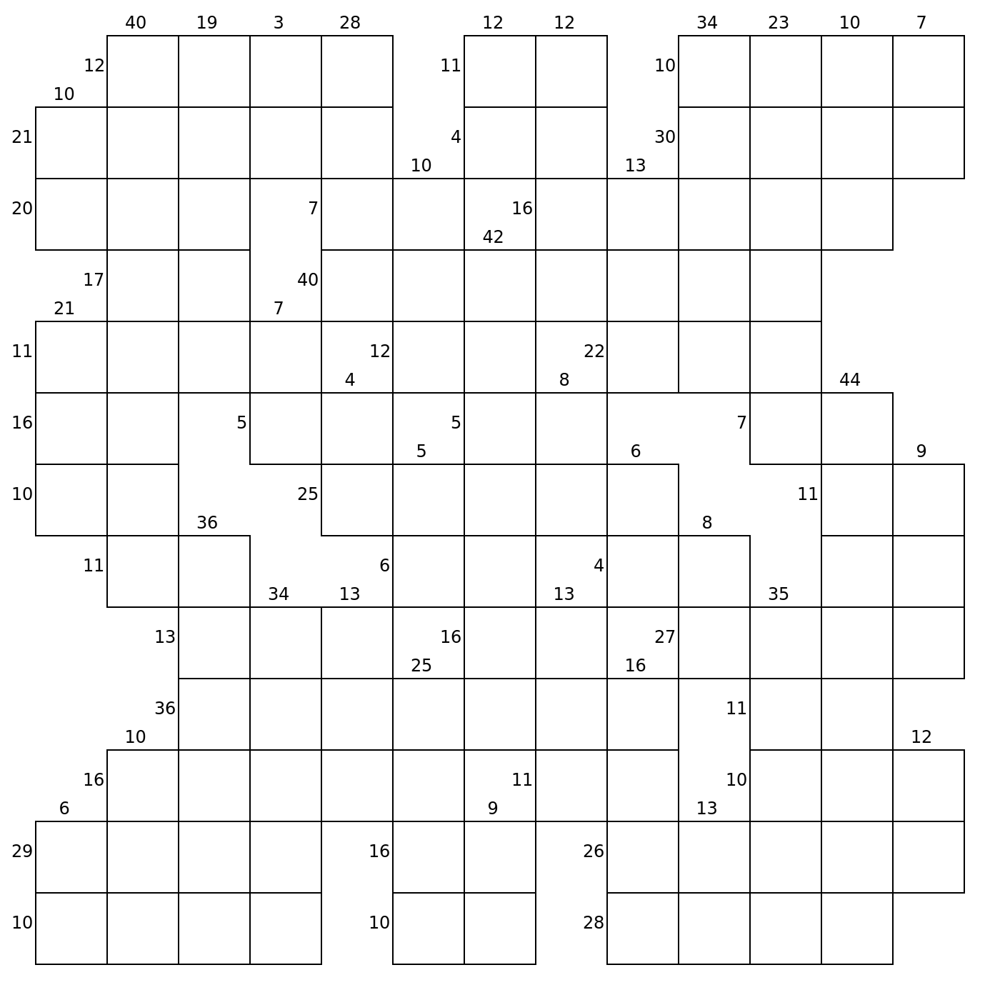
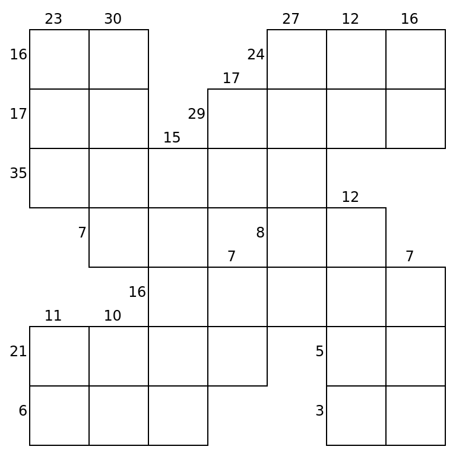

topics = [ "code", "Rust" ]
description = "Have you ever wondered what would happen if Crosswords and Sudokus had a baby? I know I haven't, but on a vacation in Lisbon, a Sudoku book in our flat introduced me to the concept of Kakuros."
read_minutes = 22

--start--

# Solving Kakuros

Have you ever wondered what would happen if Crosswords and Sudokus had a baby?
I know I haven't, but on a vacation in Lisbon, a Sudoku book in our flat introduced me to the concept of Kakuros:


Like Sudokus, you have to fill all cells with the digits 1 through 9 and the same digit can't appear twice in the same word.
Like crosswords, the layout is all over the place and you have clues. In this puzzle, however, those clues are not a description of a word, but the sum of the digits.

To get an intuition about how to approach a Kakuro, here's a tiny one:

<style>
.kakuro {
    background: var(--yellow);
    text-align: center;
    padding-bottom: 0;
}
.cell {
    fill: white;
    stroke: black;
    stroke-width: 2px;
}
.clue {
    font-family: sans-serif;
    font-size: 24px;
    fill: black;
}
</style>
<div class="kakuro card">
<svg class="board" viewBox="50 50 400 300" xmlns="http://www.w3.org/2000/svg" style="max-height: 9em;">
<text class="clue" x="140" y="90" text-anchor="middle">2</text>
<text class="clue" x="240" y="90" text-anchor="middle">4</text>
<text class="clue" x="95" y="150" text-anchor="end">13</text>
<rect class="cell" x="100" y="100" height="100" width="100" />
<rect class="cell" x="200" y="100" height="100" width="100" />
<rect class="cell" x="300" y="100" height="100" width="100" />
<rect class="cell" x="200" y="200" height="100" width="100" />
</svg>
</div>

--snip--

The clue 2 indicates that the sum of the digits below has to be 2. Because there's only one cell, we can put a 2 in there.

<style>
.digit {
    font-family: var(--sans), sans-serif;
    font-size: 50px;
    fill: black;
}
</style>
<div class="kakuro card">
<svg class="board" viewBox="50 50 400 300" xmlns="http://www.w3.org/2000/svg" style="max-height: 9em;">
<text class="clue" x="140" y="90" text-anchor="middle">2</text>
<text class="clue" x="240" y="90" text-anchor="middle">4</text>
<text class="clue" x="95" y="150" text-anchor="end">13</text>
<rect class="cell" x="100" y="100" height="100" width="100" />
<text class="digit" x="150" y="170" text-anchor="middle">2</text>
<rect class="cell" x="200" y="100" height="100" width="100" />
<rect class="cell" x="300" y="100" height="100" width="100" />
<rect class="cell" x="200" y="200" height="100" width="100" />
</svg>
</div>

There are three ways of adding two digits to 4: You can add 1+3, 2+2, and 3+1. Because the same digit can't appear twice in the same word, that leaves 1 and 3 as well as 3 and 1 for the column. The 1 can't be at the top though: If it was, then the cell on the right would have to contain a 10 to reach the horizontal sum of 13, but only the digits 1 through 9 are allowed. Thus, the 1 goes to the bottom and the 3 to the top.

Finally, we can calculate that the last digit needs to be an 8.
And that's it:

<div class="kakuro card">
<svg class="board" viewBox="50 50 400 300" xmlns="http://www.w3.org/2000/svg" style="max-height: 9em;">
<text class="clue" x="140" y="90" text-anchor="middle">2</text>
<text class="clue" x="240" y="90" text-anchor="middle">4</text>
<text class="clue" x="95" y="150" text-anchor="end">13</text>
<rect class="cell" x="100" y="100" height="100" width="100" />
<text class="digit" x="150" y="170" text-anchor="middle">2</text>
<rect class="cell" x="200" y="100" height="100" width="100" />
<text class="digit" x="250" y="170" text-anchor="middle">3</text>
<rect class="cell" x="300" y="100" height="100" width="100" />
<text class="digit" x="350" y="170" text-anchor="middle">8</text>
<rect class="cell" x="200" y="200" height="100" width="100" />
<text class="digit" x="250" y="270" text-anchor="middle">1</text>
</svg>
</div>

Tadaa! You just solved your first Kakuro.

Well… to be honest, I'm not even sure this is a valid Kakuro.
All Kakuros I saw have a clue for *every* row and column.
For example, here's the first Kakuro from the book, which took us two days to solve:

<div class="kakuro card">

</div>

Speaking of spending way too much time on something: Getting experience in profiling and optimizing code was on my todo list for some time, so I took this opportunity to [write a Kakuro solver in Rust](https://github.com/MarcelGarus/kakuro)!

## Modelling Kakuros in Code

First, I developed a file format to store Kakuros:

```txt
# The small Kakuro from above.
  \    2\    4\     \
  \11 _____ _____ _____
  \     \   _____   \
```

Underscores represent empty cells and backslashes indicate walls with an optional vertical and horizontal sum on either side of the backslash.
For example, the `4\` indicates that the sum of the cells below should be 4.
Files get parsed into a two-dimensional vector of cells:

```rust
struct Board {
    cells: Vec<Vec<Cell>>, // Outer is vertical, inner horizontal.
}
enum Cell {
    Empty, // Needs to be filled with a digit.
    Wall {
        vertical_sum: Option<Value>,
        horizontal_sum: Option<Value>,
    },
}
type Value = u8;
```

This data structure is pretty close to how Kakuros are visually shown.
While that's great for some use-cases (such as generating Kakuros or converting them into the images in this article), they contain redundant information that gets in the way when trying to *solve* the Kakuro.
For example, horizontal and vertical sums are treated differently and it's difficult to get all cells to which a sum applies.

That's why I abstracted Kakuros into a more generic form:
Instead of treating them as a grid, the program handles them as a singular line of cells that are governed by constraints.
For the purposes of solving the Kakuro, showing someone the small example from above is equivalent to giving them the following:

<style>
.constraint-connection {
    stroke: black;
    stroke-width: 4;
}
</style>
<div class="kakuro card">
<svg class="board" viewBox="50 0 500 300" xmlns="http://www.w3.org/2000/svg" style="max-height: 9em;">
<rect class="cell" x="100" y="100" height="100" width="100" />
<rect class="cell" x="200" y="100" height="100" width="100" />
<rect class="cell" x="300" y="100" height="100" width="100" />
<rect class="cell" x="400" y="100" height="100" width="100" />
<text class="clue" x="150" y="50" text-anchor="middle">2</text>
<line class="constraint-connection" x1="150" y1="60" x2="150" y2="100"></line>
<text class="clue" x="350" y="50" text-anchor="middle">4</text>
<line class="constraint-connection" x1="340" y1="60" x2="250" y2="100"></line>
<line class="constraint-connection" x1="360" y1="60" x2="450" y2="100"></line>
<text class="clue" x="250" y="280" text-anchor="middle">13</text>
<line class="constraint-connection" x1="230" y1="250" x2="150" y2="200"></line>
<line class="constraint-connection" x1="250" y1="250" x2="250" y2="200"></line>
<line class="constraint-connection" x1="260" y1="250" x2="350" y2="200"></line>
</svg>
</div>

The Rust version of this is pretty straightforward:

```rust
struct Input {
    num_cells: usize,
    constraints: Vec<Constraint>,
}
struct Constraint {
    cells: Vec<usize>, // The indices of the cells to which this applies.
    sum: Value,
}
```

Solutions to Kakuros are then represented as a vector with a value for every cell – a `rust:Vec<Value>`.
To check if a given solution is valid, we need to check that all numbers are in the range from 1 through 9 and that all constraints are satisfied:

```rust
impl Input {
    pub fn is_solution(&self, solution: &Vec<Value>) -> bool {
        solution.len() == self.num_cells
            && solution.iter().all(|number| (1..=9).contains(number))
            && self
                .constraints
                .iter()
                .all(|constraint| constraint.is_solution(solution))
    }
}
impl Constraint {
    pub fn is_solution(&self, solution: &Vec<Value>) -> bool {
        let digits = self.cells.iter().map(|i| solution[*i]).collect_vec();
        let unique_digits = digits.iter().copied().collect::<HashSet<_>>();

        if unique_digits.len() < digits.len() {
            false // A digit appears twice.
        } else {
            digits.iter().sum::<Value>() == self.sum
        }
    }
}
```

Functions for solving a Kakuro then have this signature:

```rust
fn solve(input: &Input) -> Vec<Vec<Value>> {
    // Here goes the code for solving the Kakuro.
}
```

If you're wondering why it returns a `rust:Vec<Vec<Value>>` instead of just a `rust:Vec<Value>`:
There may be Kakuros without a solution or ambiguous Kakuros with multiple solutions.
The solver should handle these cases correctly too.

I'll develop several versions of the solver that are optimized in various ways.
All versions will use the same function signature so we can compare their performance.
With that in place, let's write the first solver!

## A Naive Approach

To get started, we'll create a very simple solver:
It just tries all combinations and checks if they are valid solutions.
It starts by filling all cells with 1s, and then counts them up, treating them like a single number: For a four-cell Kakuro, it first tries 1111, then 1112, 1113, etc. until it reaches 9999.

```rust
pub fn solve(input: &Input) -> Vec<Vec<Value>> {
    let mut attempt = vec![1; input.num_cells];
    let mut solutions = vec![];

    'search: loop {
        if input.is_solution(&attempt) {
            solutions.push(attempt.clone());
        }

        // Increase attempt by one, interpreted as a single number.
        let mut i = attempt.len() - 1;
        loop {
            attempt[i] += 1;
            if attempt[i] == 10 {
                attempt[i] = 1;
                if i == 0 {
                    break 'search;
                }
                i -= 1;
            } else {
                break;
            }
        }
    }

    solutions
}
```

Nice! These hardly thirty lines of code suffice for solving small Kakuros.
The four-cell Kakuro I introduced to you above got solved quickly.
Sadly, for bigger Kakuros, the runtime increases exponentially with the number of cells – each additional cell means that nine times more combinations have to be constructed and validated.

For instance, even after running on my computer for an hour, the solver hasn't solved this Kakuro from the [Kakuro Wikipedia page](https://en.wikipedia.org/wiki/Kakuro), which is titled "An easy Kakuro puzzle":

<div class="kakuro card">

</div>

We have our first goal: Solve the Wikipedia Kakuro!

## Filling the Cells One by One

If you reflect on how we humans solve Kakuros, it's obvious that we don't fill out all cells and then check if everything works out.
Instead, we *gradually* fill the cells one by one, and at each step, we are carefully paying attention so that the Kakuro remains valid.
Let's do something similar in code!

Now, our candidate is no longer a `rust:Vec<Value>`.
Instead, each value is optional, resembling a cell that's either blank or filled with a digit: `rust:Vec<Option<Value>>`
This way, we can represent partially filled-out Kakuros.

Because we changed how a Kakuro is represented, we also have to adjust how we check a candidate's validity.
Before, we checked if all constraints are met.
Now, we only do that for constraints where each cell is filled out.

While we're at it, let's do another optimization:
Because we *know* that we only fill in numbers between 1 and 9, we can remove the check for that.

```rust
impl Input {
    fn is_possible_solution(&self, attempt: &[Option<Value>]) -> bool {
        self.constraints.iter().all(|constraint| constraint.is_possible_solution(attempt))
    }
}
impl Constraint {
    fn is_possible_solution(&self, attempt: &[Option<Value>]) -> bool {
        let cells = self.cells.iter().map(|i| attempt[*i]).collect_vec();
        let digits = cells.into_iter().filter_map(|it| it).collect_vec();
        let unique_digits = digits.iter().copied().collect::<HashSet<_>>();

        if unique_digits.len() < digits.len() {
            false // A digit appears twice.
        } else if digits.len() < self.cells.len() {
            true // Ignore partially filled-out constraints.
        } else {
            digits.iter().sum::<Value>() == self.sum
        }
    }
}
```

We'll stick with the brute force approach of trying out lots of combinations, but we'll fill the cells one by one and abort as soon as the Kakuro becomes invalid.
We can use recursion to do that:

```rust
pub fn solve(input: &Input) -> Output {
    let mut attempt: Vec<Option<Value>> = vec![None; input.num_cells];
    let mut solutions = vec![];
    solve_rec(input, &mut attempt, &mut solutions);
    solutions
}
fn solve_rec(input: &Input, attempt: &mut Vec<Option<Value>>, solutions: &mut Vec<Solution>) {
    if !input.is_possible_solution(attempt) {
        return;
    }

    let first_empty_cell_index = attempt.iter().position(|it| it.is_none());
    if let Some(index) = first_empty_cell_index {
        for i in 1..=9 {
            attempt[index] = Some(i);
            solve_rec(input, attempt, solutions);
        }
        attempt[index] = None;
    } else {
        // There is no remaining empty cell. This is a solution.
        solutions.push(attempt.iter().map(|cell| cell.unwrap()).collect());
    }
}
```

We could just as easily have given each recursive step its copy of a game instead of making it fill the first empty cell with digits and then clean up after itself in the end, but that would require us to copy lots and lots of data.
In the current implementation, all recursive calls act on the same memory region, rapidly modifying it and only copying it if a new solution was found.

Compared to the naive solver, this is *fast!*
It even solves the Wikipedia Kakuro in about 5 seconds.
To get a more comprehensive comparison between the solvers, I also attempted to solve some Kakuros from [kakuros.com](https://www.kakuros.com), their sizes ranging from 15&times;15 to 30&times;30.
It has no chance against most of them though, and the Kakuro from the book also remains unsolved.
Here are the results:

<style>
table {
  text-align: right;
  font-family: var(--sans), sans-serif;
  font-weight: bold;
  margin: auto;
}
th { padding: 0 1em; }
td { padding: 0 1em; }

.ns { color: var(--purple); }
.us { color: var(--turquoise); }
.ms { color: var(--green); }
.s { color: var(--orange); }
.bad { color: var(--pink); }
</style>
<table>
  <tr>
    <th></th>
    <th>four-cell</th>
    <th>wikipedia</th>
    <th>15&times;15</th>
    <th>20&times;20</th>
    <th>30&times;30</th>
    <th>book</th>
  </tr>
  <tr>
    <td><b>naive</b></td>
    <td class="us">793.01&nbsp;μs</td>
    <td class="bad">&gt;&nbsp;1&nbsp;h</td>
    <td class="bad">&gt;&nbsp;1&nbsp;h</td>
    <td class="bad">&gt;&nbsp;1&nbsp;h</td>
    <td class="bad">&gt;&nbsp;1&nbsp;h</td>
    <td class="bad">&gt;&nbsp;1&nbsp;h</td>
  </tr>
  <tr>
    <td><b>gradual</b></td>
    <td class="us">863.55&nbsp;μs</td>
    <td class="ms">831.44&nbsp;ms</td>
    <td class="s"> 101.93&nbsp;s</td>
    <td class="bad">&gt;&nbsp;1&nbsp;h</td>
    <td class="bad">&gt;&nbsp;1&nbsp;h</td>
    <td class="bad">&gt;&nbsp;1&nbsp;h</td>
  </tr>
</table>

## Nine Plus What Is Four?

Watching the solver doing its work, it sometimes tries to continue working with attempts that we humans would immediately reject.
For example, do you think the following attempt is valid?

<div class="kakuro card">
<svg class="board" viewBox="50 50 400 300" xmlns="http://www.w3.org/2000/svg" style="max-height: 9em;">
<text class="clue" x="140" y="90" text-anchor="middle">2</text>
<text class="clue" x="240" y="90" text-anchor="middle">4</text>
<text class="clue" x="95" y="150" text-anchor="end">14</text>
<rect class="cell" x="100" y="100" height="100" width="100" />
<text class="digit" x="150" y="170" text-anchor="middle">2</text>
<rect class="cell" x="200" y="100" height="100" width="100" />
<text class="digit" x="250" y="170" text-anchor="middle">9</text>
<rect class="cell" x="300" y="100" height="100" width="100" />
<rect class="cell" x="200" y="200" height="100" width="100" />
</svg>
</div>

Duh, obviously not!
The sum of the center cells can never be 4 if there's a 9 in one of them.

However, the solver continues looking for a digit to fit in the right cell.
Only when it eventually succeeds by filling in a 3, does it realize that no digit in the bottom cell satisfies the last constraint.
We can make the solver do better than that!

Let's modify the `rust:is_possible_solution` function so that it doesn't skip the entire sum checking if a constraint is not completely filled out yet.
Rather, ensure that there exists a constraint-fulfilling combination of digits for the other cells:

```rust
impl Constraint {
    fn is_possible_solution(&self, attempt: &[Option<Value>]) -> bool {
        let cells = self.cells.iter().map(|i| attempt[*i]).collect_vec();
        let digits = cells.into_iter().filter_map(|it| it).collect_vec();
        let unique_digits = digits.iter().copied().collect::<HashSet<_>>();

        if unique_digits.len() < digits.len() {
            return false; // A digit appears twice.
        }
        if digits.is_empty() {
            return true; // No cells filled out yet; we assume the constraint is satisfiable.
        }

        let sum: Value = digits.iter().sum();
        let unused_digits: HashSet<Value> = HashSet::from_iter(1..=9)
            .difference(&unique_digits)
            .map(|digit| *digit)
            .collect();
        let is_sum_reachable = unused_digits
            .into_iter()
            .combinations(self.cells.len() - digits.len())
            .map(|additional_digits| sum + additional_digits.into_iter().sum::<Value>())
            .any(|possible_sum| possible_sum == self.sum);
        is_sum_reachable
    }
}
```

Lo and behold!
This change is enough to solve the Kakuro from the book, although it took almost two minutes of computation:

<table>
  <tr>
    <th></th>
    <th>four-cell</th>
    <th>wikipedia</th>
    <th>15&times;15</th>
    <th>20&times;20</th>
    <th>30&times;30</th>
    <th>book</th>
  </tr>
  <tr>
    <td><b>naive</b></td>
    <td class="us">793.01&nbsp;μs</td>
    <td class="bad">&gt;&nbsp;1&nbsp;h</td>
    <td class="bad">&gt;&nbsp;1&nbsp;h</td>
    <td class="bad">&gt;&nbsp;1&nbsp;h</td>
    <td class="bad">&gt;&nbsp;1&nbsp;h</td>
    <td class="bad">&gt;&nbsp;1&nbsp;h</td>
  </tr>
  <tr>
    <td><b>gradual</b></td>
    <td class="us">863.55&nbsp;μs</td>
    <td class="ms">831.44&nbsp;ms</td>
    <td class="s"> 101.93&nbsp;s</td>
    <td class="bad">&gt;&nbsp;1&nbsp;h</td>
    <td class="bad">&gt;&nbsp;1&nbsp;h</td>
    <td class="bad">&gt;&nbsp;1&nbsp;h</td>
  </tr>
  <tr>
    <td><b>sum&nbsp;reachable</b></td>
    <td class="us"> 43.12&nbsp;μs</td>
    <td class="ms"> 31.95&nbsp;ms</td>
    <td class="ms">113.88&nbsp;ms</td>
    <td class="s">   1.24&nbsp;s</td>
    <td class="s">  72.74&nbsp;s</td>
    <td class="s"> 108.57&nbsp;s</td>
  </tr>
</table>

## Which Cell to Try Next?

Another way in which the solver's strategy differs from how humans solve Kakuros is that it fills the cells out line by line in the order that they were given.
That's not always the best approach.
For example, in the following Kakuro, it wouldn't make sense to fill it out from top to bottom:

<div class="kakuro card">
<svg class="board" viewBox="50 50 400 400" xmlns="http://www.w3.org/2000/svg" style="max-height: 12em;">
<text class="clue" x="140" y="90" text-anchor="middle">14</text>
<text class="clue" x="340" y="90" text-anchor="middle">23</text>
<rect class="cell" x="100" y="100" width="100" height="100" />
<rect class="cell" x="300" y="100" width="100" height="100" />
<text class="clue" x="95" y="250" text-anchor="end">2</text>
<rect class="cell" x="100" y="200" width="100" height="100" />
<text class="clue" x="240" y="290" text-anchor="middle">8</text>
<text class="clue" x="295" y="250" text-anchor="end">8</text>
<rect class="cell" x="300" y="200" width="100" height="100" />
<text class="clue" x="95" y="350" text-anchor="end">24</text>
<rect class="cell" x="100" y="300" width="100" height="100" />
<rect class="cell" x="200" y="300" width="100" height="100" />
<rect class="cell" x="300" y="300" width="100" height="100" />
</svg>
</div>

Rather, after filling out a cell, you'd continue filling out neighboring cells.

We can model this in code by preferring to fill out cells that are near filled out cells.
The more partially-filled constraints contain a certain cell, the more likely we are to fill that cell:

```rust
// For each cell, save how many partially-filled constraints contain it.
let mut cell_priorities = vec![0; input.num_cells];
for constraint in &input.constraints {
    let is_partially_filled = constraint
        .cells
        .iter()
        .any(|index| attempt[*index].is_some());
    if is_partially_filled {
        for i in &constraint.cells {
            if attempt[*i].is_none() {
                cell_priorities[*i] += 1;
            }
        }
    }
}

let cell_to_fill = cell_priorities
    .into_iter()
    .enumerate()
    .max_by_key(|(_, priority)| *priority)
    .and_then(|(cell, priority)| {
        if priority > 0 {
            // The cell is guaranteed to be empty because only the priority
            // of empty cells can be non-zero.
            Some(cell)
        } else {
            // No constraint contains a digit _and_ an empty cell. Just fill
            // the first empty cell.,
            attempt.iter().position(|it| it.is_none())
        }
    });

if let Some(cell) = cell_to_fill {
    for i in 1..=9 {
        attempt[cell] = Some(i);
        solve_rec(input, attempt, solutions);
    }
    attempt[cell] = None;
} else {
    // This is a solution.
    solutions.push(attempt.iter().map(|it| it.unwrap()).collect());
}
```

Let's see how we do in benchmarks:


<table>
  <tr>
    <th></th>
    <th>four-cell</th>
    <th>wikipedia</th>
    <th>15&times;15</th>
    <th>20&times;20</th>
    <th>30&times;30</th>
    <th>book</th>
  </tr>
  <tr>
    <td><b>naive</b></td>
    <td class="us">793.01&nbsp;μs</td>
    <td class="bad">&gt;&nbsp;1&nbsp;h</td>
    <td class="bad">&gt;&nbsp;1&nbsp;h</td>
    <td class="bad">&gt;&nbsp;1&nbsp;h</td>
    <td class="bad">&gt;&nbsp;1&nbsp;h</td>
    <td class="bad">&gt;&nbsp;1&nbsp;h</td>
  </tr>
  <tr>
    <td><b>gradual</b></td>
    <td class="us">863.55&nbsp;μs</td>
    <td class="ms">831.44&nbsp;ms</td>
    <td class="s"> 101.93&nbsp;s</td>
    <td class="bad">&gt;&nbsp;1&nbsp;h</td>
    <td class="bad">&gt;&nbsp;1&nbsp;h</td>
    <td class="bad">&gt;&nbsp;1&nbsp;h</td>
  </tr>
  <tr>
    <td><b>sum&nbsp;reachable</b></td>
    <td class="us"> 43.12&nbsp;μs</td>
    <td class="ms"> 31.95&nbsp;ms</td>
    <td class="ms">113.88&nbsp;ms</td>
    <td class="s">   1.24&nbsp;s</td>
    <td class="s">  72.74&nbsp;s</td>
    <td class="s"> 108.57&nbsp;s</td>
  </tr>
  <tr>
    <td><b>prioritize</b></td>
    <td class="us"> 97.86&nbsp;μs</td>
    <td class="ms">324.32&nbsp;ms</td>
    <td class="ms">390.11&nbsp;ms</td>
    <td class="s"> 310.38&nbsp;s</td>
    <td class="bad">&gt;&nbsp;1&nbsp;h</td>
    <td class="s"> 481.85&nbsp;s</td>
  </tr>
</table>

Huh.
While the approach sounds promising at first, it's a lot slower on bigger Kakuros.
And that's reasonable – if you have a giant Kakuro, looking at all cells to find the best possible one to fill out next is somewhat overkill.
There's a tradeoff: All the time you spend on deciding which cell to fill out is time you could have spent *actually* filling out cells and trimming down the solution space.

Doing expensive calculations just to decide where to investigate further turned out to not be a great deal in practice.
And that's okay.
That's why we measure the performance in the first place.
For now, I'll continue with the straightforward approach of filling out cells in the order they were given.

## Checking Uniqueness More Efficiently

Because the previous optimization did not work out, let's see where the program actually spends most of its time.
Using `bash:cargo flamegraph`, we can get a chart that shows us how much time is spent in which part of the program.
It looks like inside the `rust:solve_rec` function, most of the time (apart from going to the next recursion step) is spent in `rust:is_possible_solution`.
In particular, constructing a `rust:HashSet` for checking the uniqueness of numbers is slow:

<style>
.flamegraph-card {
    background: #c59bff;
}
.flamegraph {
    width: 100%;
    height: 40rem;
    border: none;
}
</style>
<div class="flamegraph-card card">
<iframe class="flamegraph" src="files/kakuro-flamegraph-sum-reachable.svg"></iframe>
</div>

Most of my programming experience is with high-level languages and high-level applications, where making your intent clear is the utmost concern and where performance is usually not a problem.
If you're coming from a systems programming background, you probably already cringed when I introduced uniqueness checking before:

```rust
let unique_digits = digits.iter().copied().collect::<HashSet<_>>();

if unique_digits.len() < digits.len() {
    return false; // A digit appears twice.
}

...

let sum: Value = digits.iter().sum();
let unused_digits: HashSet<Value> = HashSet::from_iter(1..=9)
    .difference(&unique_digits)
    .map(|digit| *digit)
    .collect();
...
```

While this is nice to read and easy to understand (if you're familiar with sets), it's also a performance sink.

Complexity-wise, `rust:HashSet`s are a good choice, but they pay for that with a *huge* constant factor:
Every item is hashed into an 8-byte number and then assigned to a bucket in an array that needs to be maintained.
When adding an item, several edge cases need to be caught, like hash collisions or growing the bucket array.
This might make sense if you store many items, but for *nine digits at most,* a `rust:HashSet` is a huge beast you're unleashing on your code.
It's like using a library indexing system to store your shopping list – sure, it works, but unless you need to buy hundreds of ingredients for a complicated recipe, writing it down by hand on a single sheet of paper is faster. Especially if you only have nine items.

So let's get rid of the `rust:HashSet`s (yes, plural) and replace them with custom code that changes an array of booleans depending on what digits exist:

```rust
let mut seen = [false; 9];
for digit in &digits {
    if seen[(digit - 1) as usize] {
        return false; // A digit appears twice.
    } else {
        seen[(digit - 1) as usize] = true;
    }
}

let sum: Value = digits.iter().sum();
let unused_digits = (1..=9u8).filter(|digit| !seen[(digit - 1) as usize]).collect_vec();
...
```

And fair enough, replacing hash sets with this makes the solver five times faster:

<table>
  <tr>
    <th></th>
    <th>four-cell</th>
    <th>wikipedia</th>
    <th>15&times;15</th>
    <th>20&times;20</th>
    <th>30&times;30</th>
    <th>book</th>
  </tr>
  <tr>
    <td><b>naive</b></td>
    <td class="us">793.01&nbsp;μs</td>
    <td class="bad">&gt;&nbsp;1&nbsp;h</td>
    <td class="bad">&gt;&nbsp;1&nbsp;h</td>
    <td class="bad">&gt;&nbsp;1&nbsp;h</td>
    <td class="bad">&gt;&nbsp;1&nbsp;h</td>
    <td class="bad">&gt;&nbsp;1&nbsp;h</td>
  </tr>
  <tr>
    <td><b>gradual</b></td>
    <td class="us">863.55&nbsp;μs</td>
    <td class="ms">831.44&nbsp;ms</td>
    <td class="s"> 101.93&nbsp;s</td>
    <td class="bad">&gt;&nbsp;1&nbsp;h</td>
    <td class="bad">&gt;&nbsp;1&nbsp;h</td>
    <td class="bad">&gt;&nbsp;1&nbsp;h</td>
  </tr>
  <tr>
    <td><b>sum&nbsp;reachable</b></td>
    <td class="us"> 43.12&nbsp;μs</td>
    <td class="ms"> 31.95&nbsp;ms</td>
    <td class="ms">113.88&nbsp;ms</td>
    <td class="s">   1.24&nbsp;s</td>
    <td class="s">  72.74&nbsp;s</td>
    <td class="s"> 108.57&nbsp;s</td>
  </tr>
  <tr>
    <td><b>prioritize</b></td>
    <td class="us"> 97.86&nbsp;μs</td>
    <td class="ms">324.32&nbsp;ms</td>
    <td class="ms">390.11&nbsp;ms</td>
    <td class="s"> 310.38&nbsp;s</td>
    <td class="bad">&gt;&nbsp;1&nbsp;h</td>
    <td class="s"> 481.85&nbsp;s</td>
  </tr>
  <tr>
    <td><b>no&nbsp;set</b></td>
    <td class="us">  8.29&nbsp;μs</td>
    <td class="ms">  5.41&nbsp;ms</td>
    <td class="ms"> 21.25&nbsp;ms</td>
    <td class="ms">216.69&nbsp;ms</td>
    <td class="s">  14.83&nbsp;s</td>
    <td class="s">  21.49&nbsp;s</td>
  </tr>
</table>

## Only Check Changes

Retrospectively, this is an obvious one.
Whenever we fill in a value, we don't need to validate the entire Kakuro – only the constraints that contain the cell.

In the beginning, we can save what constraints are contain each cell.
Then, when filling out a cell, we only need to check the affected constraints:

```rust
pub fn solve(input: &Input) -> Output {
    let mut attempt = vec![None; input.num_cells];
    let mut solutions = vec![];
    let mut affected_constraints = vec![vec![]; input.num_cells];
    for (i, constraint) in input.constraints.iter().enumerate() {
        for cell in &constraint.cells {
            affected_constraints[*cell].push(i);
        }
    }
    solve_rec(input, &affected_constraints, &mut attempt, &mut solutions);
    solutions
}
fn solve_rec(
    input: &Input,
    affected_constraints: &[Vec<usize>],
    attempt: &mut Game,
    solutions: &mut Vec<Solution>,
) {
    let first_empty_cell_index = attempt.iter().position(|it| it.is_none());
    if let Some(index) = first_empty_cell_index {
        'candidates: for i in 1..=9 {
            attempt[index] = Some(i);
            for constraint_index in &affected_constraints[index] {
                let constraint = &input.constraints[*constraint_index];
                if !constraint.is_satisfied_by(attempt) {
                    continue 'candidates;
                }
            }
            solve_rec(input, affected_constraints, attempt, solutions);
        }
        attempt[index] = None;
    } else {
        solutions.push(attempt.iter().map(|cell| cell.unwrap()).collect());
    }
}
```

Nice! This yields an additional 14X speedup:

<table>
  <tr>
    <th></th>
    <th>four-cell</th>
    <th>wikipedia</th>
    <th>15&times;15</th>
    <th>20&times;20</th>
    <th>30&times;30</th>
    <th>book</th>
  </tr>
  <tr>
    <td><b>naive</b></td>
    <td class="us">793.01&nbsp;μs</td>
    <td class="bad">&gt;&nbsp;1&nbsp;h</td>
    <td class="bad">&gt;&nbsp;1&nbsp;h</td>
    <td class="bad">&gt;&nbsp;1&nbsp;h</td>
    <td class="bad">&gt;&nbsp;1&nbsp;h</td>
    <td class="bad">&gt;&nbsp;1&nbsp;h</td>
  </tr>
  <tr>
    <td><b>gradual</b></td>
    <td class="us">863.55&nbsp;μs</td>
    <td class="ms">831.44&nbsp;ms</td>
    <td class="s"> 101.93&nbsp;s</td>
    <td class="bad">&gt;&nbsp;1&nbsp;h</td>
    <td class="bad">&gt;&nbsp;1&nbsp;h</td>
    <td class="bad">&gt;&nbsp;1&nbsp;h</td>
  </tr>
  <tr>
    <td><b>sum&nbsp;reachable</b></td>
    <td class="us"> 43.12&nbsp;μs</td>
    <td class="ms"> 31.95&nbsp;ms</td>
    <td class="ms">113.88&nbsp;ms</td>
    <td class="s">   1.24&nbsp;s</td>
    <td class="s">  72.74&nbsp;s</td>
    <td class="s"> 108.57&nbsp;s</td>
  </tr>
  <tr>
    <td><b>prioritize</b></td>
    <td class="us"> 97.86&nbsp;μs</td>
    <td class="ms">324.32&nbsp;ms</td>
    <td class="ms">390.11&nbsp;ms</td>
    <td class="s"> 310.38&nbsp;s</td>
    <td class="bad">&gt;&nbsp;1&nbsp;h</td>
    <td class="s"> 481.85&nbsp;s</td>
  </tr>
  <tr>
    <td><b>no&nbsp;set</b></td>
    <td class="us">  8.29&nbsp;μs</td>
    <td class="ms">  5.41&nbsp;ms</td>
    <td class="ms"> 21.25&nbsp;ms</td>
    <td class="ms">216.69&nbsp;ms</td>
    <td class="s">  14.83&nbsp;s</td>
    <td class="s">  21.49&nbsp;s</td>
  </tr>
  <tr>
    <td><b>only&nbsp;changes</b></td>
    <td class="us">  4.84&nbsp;μs</td>
    <td class="us">740.98&nbsp;μs</td>
    <td class="ms">  2.05&nbsp;ms</td>
    <td class="ms">  9.68&nbsp;ms</td>
    <td class="ms">569.47&nbsp;ms</td>
    <td class="s">   1.48&nbsp;s</td>
  </tr>
</table>

## Track the Index of the First Empty Cell

In each recursion step, we search for the first empty cell:

```rust
let first_empty_cell_index = attempt.iter().position(|it| it.is_none());
```

Because we fill out all the cells in their order anyways, we can pass the index of the first empty cell to the recursion function directly, no calculation needed:

```rust
fn solve_rec(
    input: &Input,
    affected_constraints: &[Vec<usize>],
    first_empty: usize,
    attempt: &mut Vec<Option<Value>>,
    solutions: &mut Vec<Solution>,
) {
    if first_empty < attempt.len() {
        'candidates: for i in 1..=9 {
            attempt[first_empty] = Some(i);
            for constraint_index in &affected_constraints[first_empty] {
                let constraint = &input.constraints[*constraint_index];
                if !constraint.is_satisfied_by(attempt) {
                    continue 'candidates;
                }
            }
            solve_rec(input, affected_constraints, first_empty + 1, attempt, solutions);
        }
        attempt[first_empty] = None;
    } else {
        solutions.push(attempt.iter().map(|cell| cell.unwrap()).collect());
    }
}
```

This has an insignificant effect on the runtime though:

<table>
  <tr>
    <th></th>
    <th>four-cell</th>
    <th>wikipedia</th>
    <th>15&times;15</th>
    <th>20&times;20</th>
    <th>30&times;30</th>
    <th>book</th>
  </tr>
  <tr>
    <td><b>naive</b></td>
    <td class="us">793.01&nbsp;μs</td>
    <td class="bad">&gt;&nbsp;1&nbsp;h</td>
    <td class="bad">&gt;&nbsp;1&nbsp;h</td>
    <td class="bad">&gt;&nbsp;1&nbsp;h</td>
    <td class="bad">&gt;&nbsp;1&nbsp;h</td>
    <td class="bad">&gt;&nbsp;1&nbsp;h</td>
  </tr>
  <tr>
    <td><b>gradual</b></td>
    <td class="us">863.55&nbsp;μs</td>
    <td class="ms">831.44&nbsp;ms</td>
    <td class="s"> 101.93&nbsp;s</td>
    <td class="bad">&gt;&nbsp;1&nbsp;h</td>
    <td class="bad">&gt;&nbsp;1&nbsp;h</td>
    <td class="bad">&gt;&nbsp;1&nbsp;h</td>
  </tr>
  <tr>
    <td><b>sum&nbsp;reachable</b></td>
    <td class="us"> 43.12&nbsp;μs</td>
    <td class="ms"> 31.95&nbsp;ms</td>
    <td class="ms">113.88&nbsp;ms</td>
    <td class="s">   1.24&nbsp;s</td>
    <td class="s">  72.74&nbsp;s</td>
    <td class="s"> 108.57&nbsp;s</td>
  </tr>
  <tr>
    <td><b>prioritize</b></td>
    <td class="us"> 97.86&nbsp;μs</td>
    <td class="ms">324.32&nbsp;ms</td>
    <td class="ms">390.11&nbsp;ms</td>
    <td class="s"> 310.38&nbsp;s</td>
    <td class="bad">&gt;&nbsp;1&nbsp;h</td>
    <td class="s"> 481.85&nbsp;s</td>
  </tr>
  <tr>
    <td><b>no&nbsp;set</b></td>
    <td class="us">  8.29&nbsp;μs</td>
    <td class="ms">  5.41&nbsp;ms</td>
    <td class="ms"> 21.25&nbsp;ms</td>
    <td class="ms">216.69&nbsp;ms</td>
    <td class="s">  14.83&nbsp;s</td>
    <td class="s">  21.49&nbsp;s</td>
  </tr>
  <tr>
    <td><b>only&nbsp;changes</b></td>
    <td class="us">  4.84&nbsp;μs</td>
    <td class="us">740.98&nbsp;μs</td>
    <td class="ms">  2.05&nbsp;ms</td>
    <td class="ms">  9.68&nbsp;ms</td>
    <td class="ms">569.47&nbsp;ms</td>
    <td class="s">   1.48&nbsp;s</td>
  </tr>
  <tr>
    <td><b>pass index</b></td>
    <td class="us">  5.12&nbsp;μs</td>
    <td class="us">734.19&nbsp;μs</td>
    <td class="ms">  2.06&nbsp;ms</td>
    <td class="ms">  9.87&nbsp;ms</td>
    <td class="ms">554.91&nbsp;ms</td>
    <td class="s">   1.46&nbsp;s</td>
  </tr>
</table>

## The Evil Heap

Let's look at the Flamegraph again.
In the optimized version of the program, lots of events are classified in the `[unknown]` bucket, so we have no stack trace for them.
What we *can* see is that the runtime is dominated by the allocation and freeing of memory:

<div class="flamegraph-card card">
<iframe class="flamegraph" src="files/kakuro-flamegraph-pass-index.svg"></iframe>
</div>

This is not surprising.
Memory on the heap is managed in a complex way – the memory allocator has to look for free areas of memory to give out and has to free and join regions of memory when they are freed.
Intrinsically, there are lots of ceremonies associated with using heap memory.

Stack memory on the other hand is cheap to use.
There's no allocator – you can just use memory in your function's stack frame without telling anyone.
It's also tightly packed together, making it very cache-friendly.

So, where do we use heap memory? And is there a way for us to reduce our usage of heap memory?

The following code seems to be the culprit:

```rust
let is_sum_reachable = unused_digits
    .into_iter()
    .combinations(self.cells.len() - digits.len())
    .map(|additional_digits| sum + additional_digits.into_iter().sum::<Value>())
    .any(|possible_sum| possible_sum == self.sum);
```

According to the documentation of `rust:combination` from the `itertools` crate, this function allocates new `Vec`s for each combination:

> Return an iterator adaptor that iterates over the `k`-length combinations of the elements from an iterator. Iterator element type is `rust:Vec<Self::Item>`. The iterator produces a new Vec per iteration, and clones the iterator elements.

The solution?
We can instead try to hand-roll an implementation that checks if the sum of the constraint is reachable.
This is also an opportunity to re-use partial sums instead of re-adding all items for each combination of values.
A quick disclaimer:
The code for this is somewhat ugly, using macros to make it slightly more bearable:

```rust
macro_rules! check_additional {
    ($nesting:expr, $digits_so_far:expr, $target_digits:expr, $sum_so_far:expr, $target_sum:expr,
    $seen:expr, $block:block) => {
        if $sum_so_far <= $target_sum {
            if $digits_so_far == $target_digits {
                if $sum_so_far == $target_sum {
                    return true;
                }
            } else {
                for a in ($nesting + 1)..=9 {
                    if $seen[a - 1] {
                        continue;
                    }
                    $digits_so_far += 1;
                    $sum_so_far += a;
                    $seen[a - 1] = true;
                    $block;
                    $digits_so_far -= 1;
                    $sum_so_far -= a;
                    $seen[a - 1] = false;
                }
            }
        }
    };
}

impl Constraint {
    fn is_satisfied_by(&self, attempt: &Vec<Option<Value>>) -> bool {
        let mut seen = [false; 9];
        let mut sum = 0usize;

        for digit in self.cells.iter().filter_map(|b| attempt[*b]) {
            if seen[(digit - 1) as usize] {
                return false; // A digit appears twice.
            }
            seen[(digit - 1) as usize] = true;
            sum += digit as usize;
        }

        let mut num_digits = seen.iter().filter(|it| **it).count();
        let target_digits  = self.cells.len();
        let target_sum = self.sum as usize;

        check_additional!(0, num_digits, target_digits, sum, target_sum, seen, {
          check_additional!(1, num_digits, target_digits, sum, target_sum, seen, {
            check_additional!(2, num_digits, target_digits, sum, target_sum, seen, {
              check_additional!(3, num_digits, target_digits, sum, target_sum, seen, {
                check_additional!(4, num_digits, target_digits, sum, target_sum, seen, {
                  check_additional!(5, num_digits, target_digits, sum, target_sum, seen, {
                    check_additional!(6, num_digits, target_digits, sum, target_sum, seen, {
                      check_additional!(7, num_digits, target_digits, sum, target_sum, seen, {
                        // Constraints are only checked if at least one cell is
                        // filled out. 8 cells later, everything is filled out.
                      });
                    });
                  });
                });
              });
            });
          });
        });
        false
    }
}
```

The uglification of code is worth it though.
We get some solid performance improvements:

<table>
  <tr>
    <th></th>
    <th>four-cell</th>
    <th>wikipedia</th>
    <th>15&times;15</th>
    <th>20&times;20</th>
    <th>30&times;30</th>
    <th>book</th>
  </tr>
  <tr>
    <td><b>naive</b></td>
    <td class="us">793.01&nbsp;μs</td>
    <td class="bad">&gt;&nbsp;1&nbsp;h</td>
    <td class="bad">&gt;&nbsp;1&nbsp;h</td>
    <td class="bad">&gt;&nbsp;1&nbsp;h</td>
    <td class="bad">&gt;&nbsp;1&nbsp;h</td>
    <td class="bad">&gt;&nbsp;1&nbsp;h</td>
  </tr>
  <tr>
    <td><b>gradual</b></td>
    <td class="us">863.55&nbsp;μs</td>
    <td class="ms">831.44&nbsp;ms</td>
    <td class="s"> 101.93&nbsp;s</td>
    <td class="bad">&gt;&nbsp;1&nbsp;h</td>
    <td class="bad">&gt;&nbsp;1&nbsp;h</td>
    <td class="bad">&gt;&nbsp;1&nbsp;h</td>
  </tr>
  <tr>
    <td><b>sum&nbsp;reachable</b></td>
    <td class="us"> 43.12&nbsp;μs</td>
    <td class="ms"> 31.95&nbsp;ms</td>
    <td class="ms">113.88&nbsp;ms</td>
    <td class="s">   1.24&nbsp;s</td>
    <td class="s">  72.74&nbsp;s</td>
    <td class="s"> 108.57&nbsp;s</td>
  </tr>
  <tr>
    <td><b>prioritize</b></td>
    <td class="us"> 97.86&nbsp;μs</td>
    <td class="ms">324.32&nbsp;ms</td>
    <td class="ms">390.11&nbsp;ms</td>
    <td class="s"> 310.38&nbsp;s</td>
    <td class="bad">&gt;&nbsp;1&nbsp;h</td>
    <td class="s"> 481.85&nbsp;s</td>
  </tr>
  <tr>
    <td><b>no&nbsp;set</b></td>
    <td class="us">  8.29&nbsp;μs</td>
    <td class="ms">  5.41&nbsp;ms</td>
    <td class="ms"> 21.25&nbsp;ms</td>
    <td class="ms">216.69&nbsp;ms</td>
    <td class="s">  14.83&nbsp;s</td>
    <td class="s">  21.49&nbsp;s</td>
  </tr>
  <tr>
    <td><b>only&nbsp;changes</b></td>
    <td class="us">  4.84&nbsp;μs</td>
    <td class="us">740.98&nbsp;μs</td>
    <td class="ms">  2.05&nbsp;ms</td>
    <td class="ms">  9.68&nbsp;ms</td>
    <td class="ms">569.47&nbsp;ms</td>
    <td class="s">   1.48&nbsp;s</td>
  </tr>
  <tr>
    <td><b>pass index</b></td>
    <td class="us">  5.12&nbsp;μs</td>
    <td class="us">734.19&nbsp;μs</td>
    <td class="ms">  2.06&nbsp;ms</td>
    <td class="ms">  9.87&nbsp;ms</td>
    <td class="ms">554.91&nbsp;ms</td>
    <td class="s">   1.46&nbsp;s</td>
  </tr>
  <tr>
    <td><b>no alloc</b></td>
    <td class="ns">743.40&nbsp;ns</td>
    <td class="us"> 84.23&nbsp;μs</td>
    <td class="us">263.48&nbsp;μs</td>
    <td class="ms">  1.12&nbsp;ms</td>
    <td class="ms"> 76.78&nbsp;ms</td>
    <td class="ms">343.88&nbsp;ms</td>
  </tr>
</table>

## Conclusion

We can solve Kakuros automatically.
The Kakuro from the book got solved in well under one second.
I *could* try to optimize the solver even further.
To be honest, though, I feel like I scratched this itch sufficiently.
Spending some time on a small project with clear metrics is fun, but life goes on.

You're welcome to mess with my code, which is [on GitHub](https://github.com/MarcelGarus/kakuro).
If you come up with more optimizations or better strategies, feel free to contact me.

---

**Edit:**
There are some more solution attempts in [the repo](https://github.com/MarcelGarus/kakuro), but their performance is somewhat unreliable.
The fastest one solves the Kakuro from the book in 89&nbsp;ms, but runs out of memory on the 30&times;30 Kakuro.
