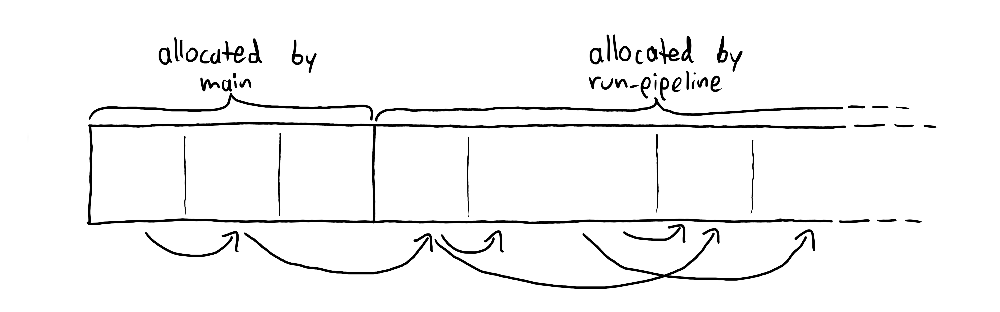
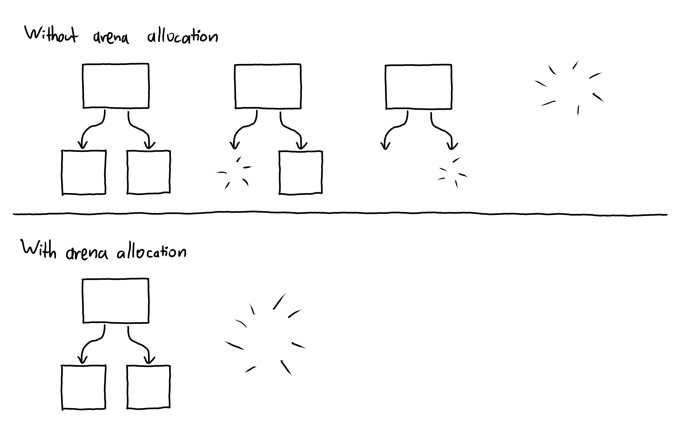

topics = [ "Zig", "programming language design", "Martinaise", "code" ]
description = "My thoughts on the Zig programming language."

--start--

# Thoughts on Zig

For some time, I've been keeping an eye on [Zig](https://ziglang.org), a systems programming language.
Contrary to C++ and Rust, it doesn't introduce more complexity to improve (memory) safety or expressiveness.
Instead, it has a similar complexity to C, but cleans up the weirdness, choosing sane defaults for most operations.

--snip--

## comptime

Perhaps the most talked-about feature of Zig is `zig:comptime` – a keyword that forces some code to run at compile time.
You can also annotate function parameters with `zig:comptime`, requiring them to be compile-time constants.
Using this, you can write generic types using functions:

```zig
// Point accepts a type t, which is required to be compile-time known.
// It then returns a specialized version of Point parameterized for that type.
fn Point(comptime T: type) type {
    return struct { x: T, y: T };
}
const point: Point(u64) = .{ .x = 0, .y = 1 };
```

Because types are just values at compile-time, you can parameterize types over other values than types.
For example, the standard library's `zig:HashMap` also takes a type for hashing and equality checking as well as a maximum load percentage, after which the hash map allocates more memory:

```zig
const FooHashAndEql = struct {
    pub fn hash(self: @This(), key: Foo) u64 { ... }
    pub fn eql(self: @This(), a: Foo, b: Foo) bool { ... }
};
HashMap(Foo, u64, FooHashAndEql, 60)
```

Here, **`zig:comptime` simplifies the language** – because of `zig:comptime`, Zig doesn't need to have a concept of generic types.

Another example of how `zig:comptime` makes the language less complex is the `zig:print` function.
In Zig, you print values like this:

```zig
std.debug.print("Hello, {}! {} is a nice number", .{"world", 42});
```

In most languages (C, Rust, C++, etc.), printing hooks into a compiler built-in.
For example, the C `c:printf` calls `c:__builtin___vsprintf_chk`, and the Rust `rust:println!` calls the built-in `rust:format_args!`.

In Zig, formatting is implemented entirely in Zig itself.
The format string is required to be a `zig:comptime` parameter.
For each call of `zig:print`, the format string is iterated at compile time and compiled into code that formats the individual arguments.

```zig
pub fn print(writer: anytype, comptime fmt: []const u8, args: anytype) !void {
    const ArgsType = @TypeOf(args);
    const args_type_info = @typeInfo(ArgsType);
    if (args_type_info != .Struct) {
        @compileError("expected tuple or struct argument, found " ++ @typeName(ArgsType));
    }

    ...

    comptime var arg_state: ArgState = .{ .args_len = fields_info.len };
    comptime var i = 0;
    // inline while is guaranteed to be unrolled at compile-time
    inline while (i < fmt.len) {
        const start_index = i;

        inline while (i < fmt.len) : (i += 1) {
            switch (fmt[i]) {
                '{', '}' => break,
                else => {},
            }
        }

        comptime var end_index = i;
        comptime var unescape_brace = false;

        // Handle {{ and }}, those are un-escaped as single braces
        if (i + 1 < fmt.len and fmt[i + 1] == fmt[i]) {
            unescape_brace = true;
            // Make the first brace part of the literal...
            end_index += 1;
            // ...and skip both
            i += 2;
        }

        ...

        const arg_to_print = comptime arg_state.nextArg(arg_pos) orelse
            @compileError("too few arguments");

        try formatType(
            @field(args, fields_info[arg_to_print].name),
            placeholder.specifier_arg,
            FormatOptions{ ... },
            writer,
            std.options.fmt_max_depth,
        );
    }

    if (comptime arg_state.hasUnusedArgs()) {
        const missing_count = arg_state.args_len - @popCount(arg_state.used_args);
        switch (missing_count) {
            0 => unreachable,
            1 => @compileError("unused argument in '" ++ fmt ++ "'"),
            else => @compileError(comptimePrint("{d}", .{missing_count}) ++ " unused arguments in '" ++ fmt ++ "'"),
        }
    }
}
```

## Memory Management

Zig requires manual memory management, so there is some bookkeeping required when writing code, even compared to Rust.
That being said, all data structures from the standard library accept an allocator in the constructor.
That makes it super easy to use arena allocators everywhere in your code.

For example, the compiler of my programming language [Martinaise](/martinaise) supports a `martinaise watch` command, which watches a file and recompiles and runs the program every time it changes.
Take a look at the function that runs the compilation pipeline:

```zig
// Runs the pipeline that matches the command. Errors are handled internally
// (stuff is printed to stdout). Returns whether it ran through successfully.
fn run_pipeline(original_alloc: Allocator, command: Command, file_path: Str) !bool {
    var arena = std.heap.ArenaAllocator.init(original_alloc);
    defer arena.deinit(); // frees the arena at the end of the scope
    const alloc = arena.allocator();

    var stdlib_size: usize = 0;
    const input = ... // reads input, allocating using alloc

    const the_ast = try parse(alloc, input, stdlib_size) catch |err| {
        std.debug.print("{s}\n", .{err});
        return false;
    };

    const the_mono = try monomorphize(alloc, the_ast) catch |err| {
        print_on_same_line("{s}", .{err});
        return false;
    };

    ...
}
```

It creates a new arena allocator and passes it to all the compiler stages.
All the data structures in those stages are allocated in the arena.
For example, lists are created using `ArrayList(SomeType).init(alloc)`.

After the stages ran through, the memory lives in a contiguous chunk of memory:



When the `zig:run_pipeline` function exits, `zig:arena.deinit()` is called and all the memory allocated during the pipeline is freed at once.

Compared to that, memory management in Rust is comparatively expensive:
When freeing a big data structure, all the data is traversed and all elements are individually freed, starting from the leaves.
Also, Rust's ownership model encourages you to `clone` values rather than aliasing them, even if they are never mutated.



I thought less about memory management than I do with Rust.
My Zig code just allocates memory all over the place, sharing immutable memory when possible, and it's still super efficient.

I know that these benefits are not a property of Zig but of arena allocation.
And there are [ways to use arena allocation in Rust](https://docs.rs/typed-arena/latest/typed_arena/).
Zig's convention of passing allocators around just makes it extremely convenient to use arenas whenever possible.

## Conclusion

Languages such as Rust are great for creating compiler-checked, safe abstractions.
For smaller projects or projects that require a lower level of control, especially over memory allocations, Zig is a promising alternative.
