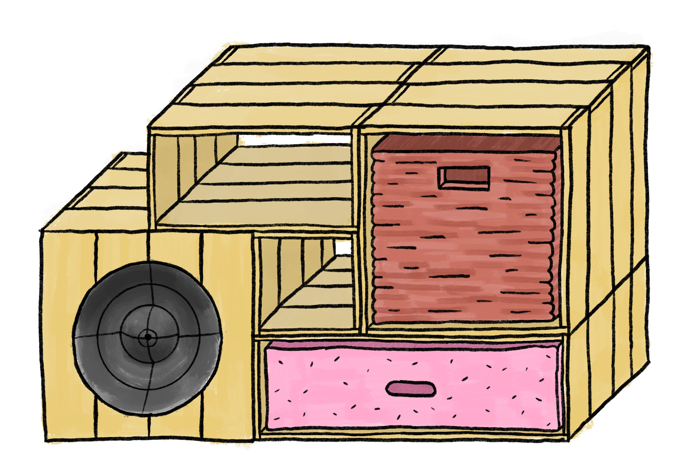
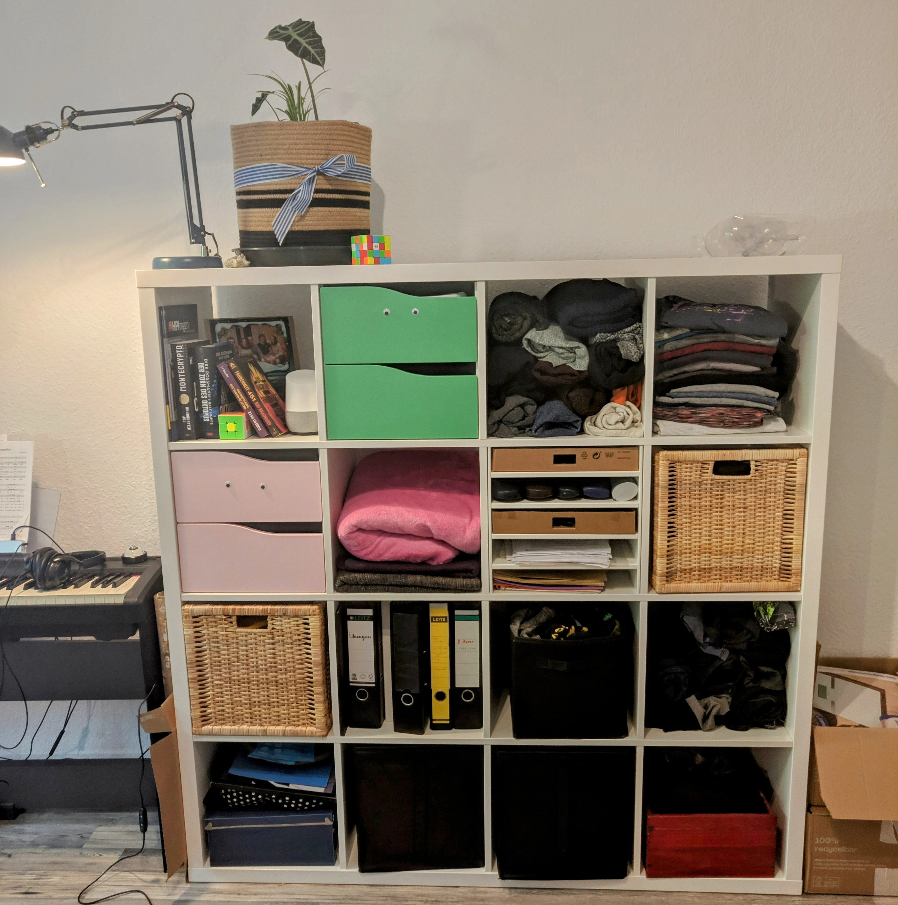
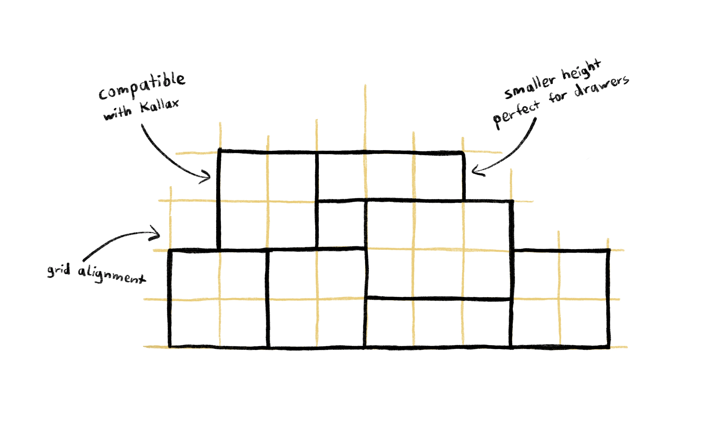
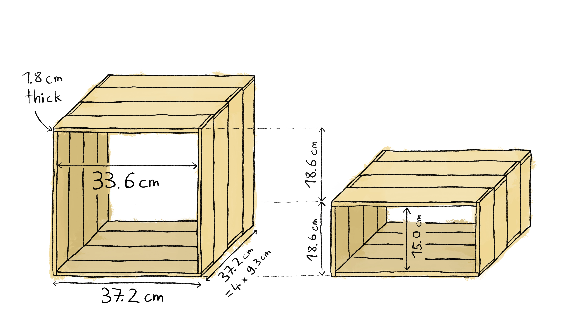
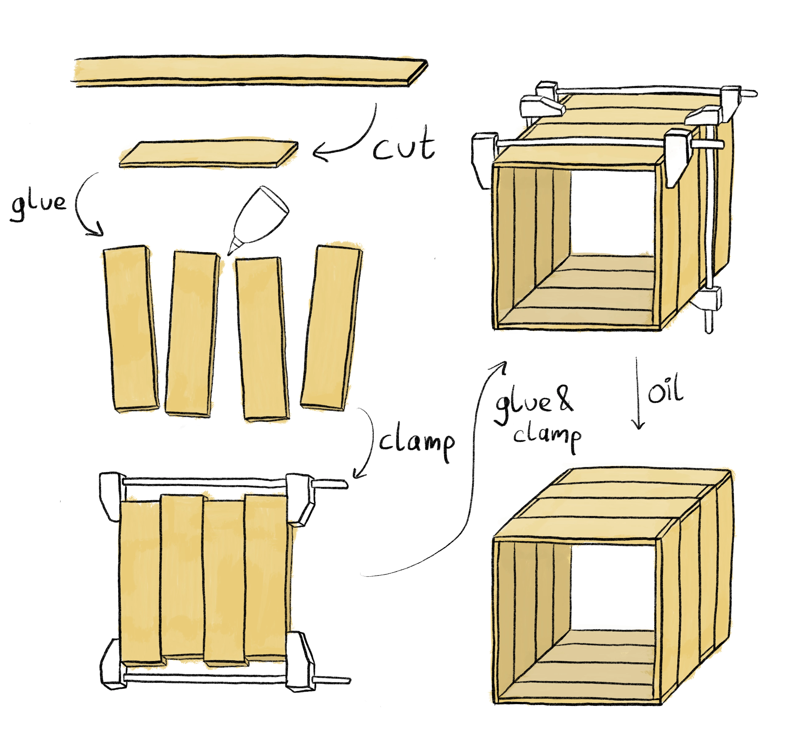
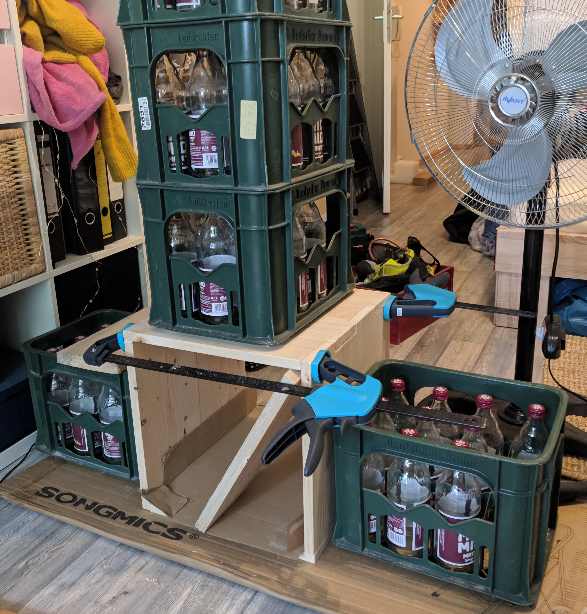
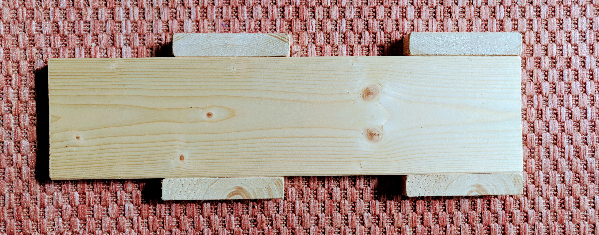
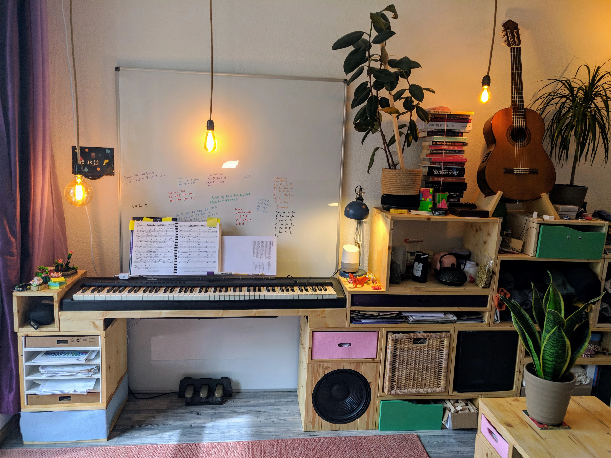

topics = [ "woodworking" ]
description = "How I replaced my Ikea Kallax shelf with a custom one."

--start--

# Building a Modular Shelf

I have created lots of digital projects, but I don't have much experience working with raw materials.
So, some time ago, I decided to build a shelf.

--snip--

Up until then, I used an Ikea Kallax shelf.

While it's fine, I had some ideas for improvements:

- **Make it space-efficient.**
  Some of the Kallax compartments are only half-filled.
  Compartments of different sizes (especially different heights) can accomodate contents of many sizes.
- **Make it modular.**
  Creating individual boxes instead of one integrated shelf allows me to reorder boxes, for example if I rearrange my room or move.
  I can replace parts of the shelf if I have new ideas for modules or want to integrate non-shelf things (such as my piano) into the shelf.
- **Make it cozy.**
  Using natural wood instead of a white or veneered surface is more cozy and durable.
  I plan to highlight imperfections of the wood such as knots or interesting ring patterns.

## Wood

Most wood can be sorted into two categories: hardwood and softwood.

Hardwood such as oak or beech comes from deciduous trees (trees with leaves).
Because they don't grow in the winter, the annual rings are close together and the wood is dense and dark – perfect for applications where the wood needs to carry a heavy load.

Softwood such as pine or spruce comes from conifers (trees with needles).
Because they grow all year round, they mature faster and are generally more sustainable and cheaper than hardwood.
The annual rings are further apart and the wood is lighter and brighter.
As the name suggests, this wood is also softer than hardwood.
That's a double-edged sword: The wood is easy to work with, but it's not as strong as hardwood and more easily scratched.

There's a local wood supplier near me, [Holzfachzentrum Potsdam](https://www.holzfachzentrumpotsdam.de/).
They have a variety of woods and I decided to go with spruce (Fichte), a cheap softwood.
Strength is not a huge limitation – by default, the planks are 1.8 cm thick, sturdy enough so I can stand on the shelf boxes.

## Planning

Given that I own an Ikea Kallax shelf as well as some inserts (such as boxes and baskets), I want my shelf to be compatible with Kallax shelves.
The easiest way to make sure that I can reorder parts of the shelf is to set up a grid and make sure all boxes are a multiple of the grid size.

A grid size of 18.6 cm works:
Holzfachzentrum Potsdam has planks that are 1.8 cm thick and 9.3 cm wide.
Boxes that are 2x2 grid units big have an inner dimension of 33.6 cm – exactly the size of a Kallax compartment.

## Making Boxes

This is how to make the boxes:
Cut wood planks to the correct length (so they are 1.8 cm x 9.3 cm x 35.4 cm), glue them together into the boards for the sides and glue those together to boxes.
Finally, you can oil the box to bring out the natural features of the wood and to make it a little more resistant to fluids and dirt.

While the process looks pretty simple from a high-level, the individual steps can be a bit tricky.
For example, making sure the boxes have right angles takes some effort.
I found that using Mate crates helps:

Also, creating custom tools can simplify the work enourmously.
Here's a piece that helps me align the planks for one side without effort:

## The Final Shelf

This is how it turned out:

A few noteworthy things:
The shelf contains my piano and a speaker!
The blue box in the lower-left contains my wifi router and Raspberry Pi server, covered with a very thin blue felt.
I use several Kallax inserts – baskets and drawers.
I added a tea-themed box that contains my tea kettle and many different teas.
I plan to add more activity-themed boxes, for example one for my sewing machine and fabrics.

Sooo, what to take away from this?
Wood is a cool material!
It's durable.
It's sustainable.
And it looks great.
Happy woodworking!
