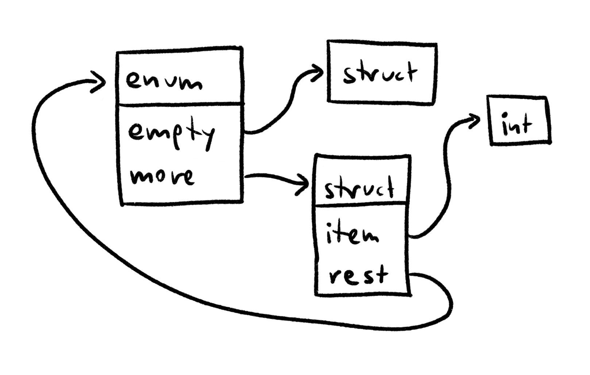
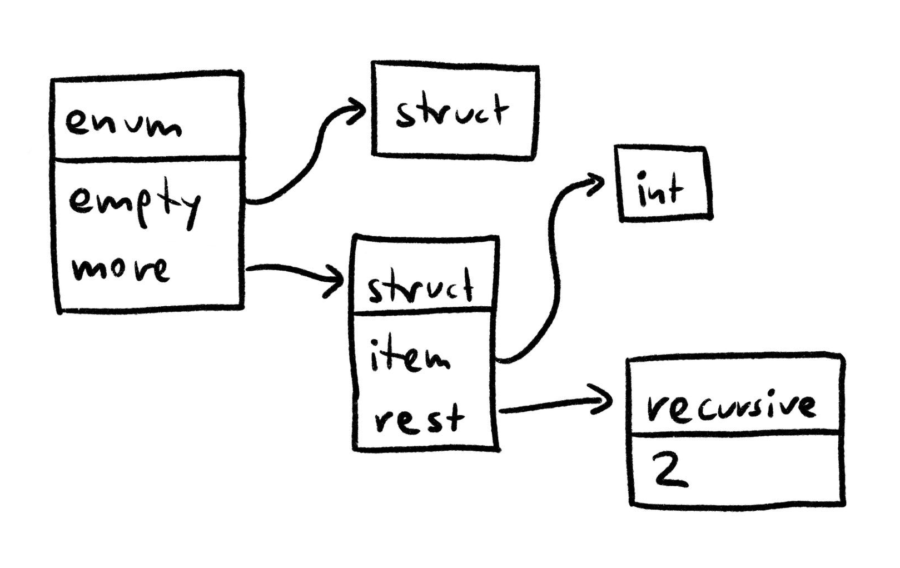
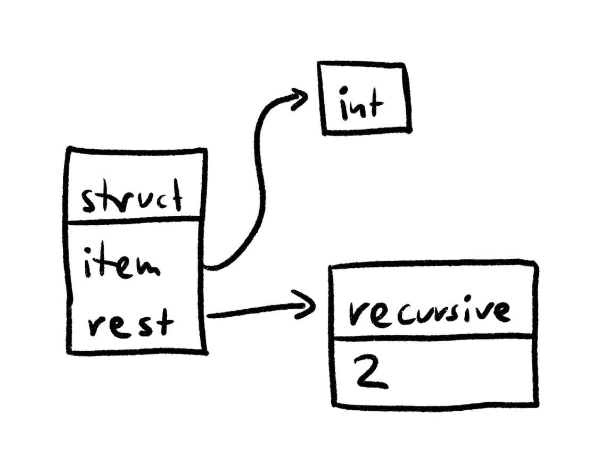
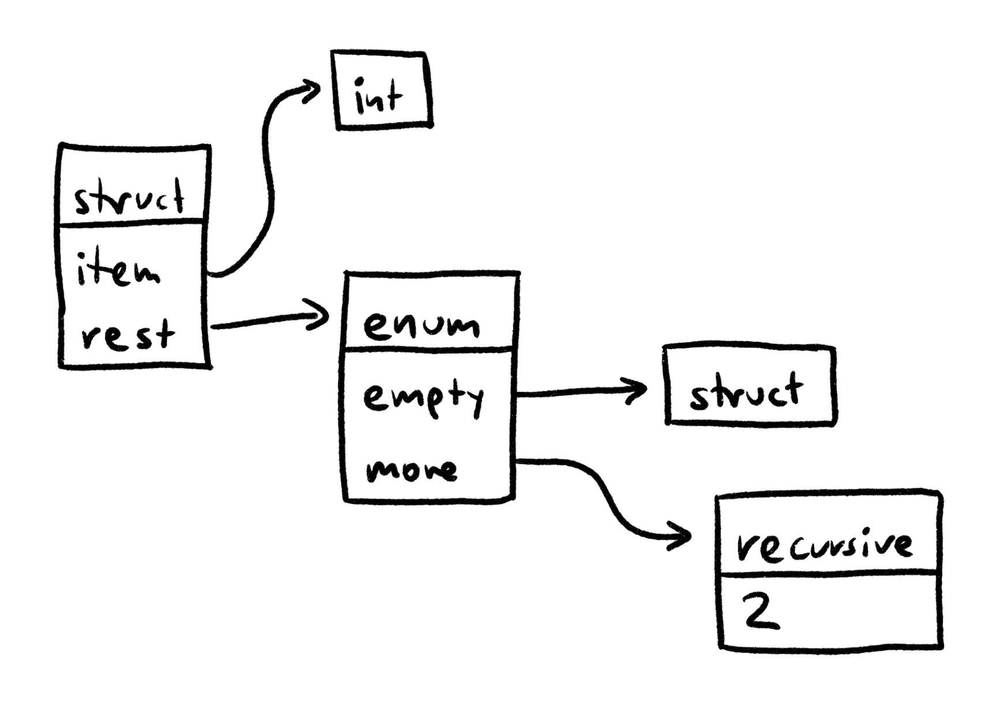

# Types in Plum

## Why the compiler models types as strings

<style>
img { max-height: 15rem; }
</style>

[Plum](/plum) is a programming language with structural typing:
Types don't have an identity.
Values of these two types can be used interchangably:

```plum
Foo = & x: Int y: Int
Bar = & x: Int y: Int
```

Essentially, named types are just aliases for the structure of the type.
This is not new or groundbreaking, but it's the first time I implemented a compiler with a structural type system.
One aspect made this a lot more challenging than I initially thought: Recursion.

Consider this type:

```plum
LinkedList t =
  | empty
    more: (& item: t rest: (LinkedList t))
```

It's an enum with two variants – `plum:empty` and `plum:more`.
The `plum:more` variant contains a struct with the `plum:item` and the `plum:rest`, which is another linked list.

You can create linked list instances like this:

```plum
| more:
    & item: 1
      rest:
        | more:
            & item: 2
              rest: | empty
```

This `plum:LinkedList Int` contains the items 1 and 2.

## Types as Graphs

So, how does the compiler internally represent types?
Because names shouldn't affect type checking in any way, so you could model types like this:

```mar
enum Type {
  int,
  struct_: Map[String, Type],
  enum_: Map[String, Type],
}
```

> Note:
> This is a simplification.
> Plum has more primitives (bytes), special types (never) and composite types (arrays, boxes, lambdas).

Here, recursive types would result in recursive data structures in the compiler:



> Note: In Plum, enum variants use an empty struct as the default payload type.

However, there are some serious downsides to this approach:
Representing types as potentially recursive data structures in the compiler require a tremendous level of care when working with them.
Simple actions such as debug-printing or hashing types can lead to infite traversals and hanging the compiler if you're not careful.
To prevent that, you have to compare type identities (the type objects' addresses), which feels clunky.

## Types as Trees

To work around these problems, I decided to model types as trees rather than recursive graphs.
I added a `plum:recursive` variant in the enum that tells us how many levels up in the type tree to continue:

```mar
enum Type {
  int,
  struct_: Map[String, Type],
  enum_: Map[String, Type],
  recursive: Int,
}
```

Using this, the `plum:LinkedList Int` type is represented like this in the compiler:



The recursive type tells us that we should start two layers further up in the tree – at the original enum.

Formatting, hashing, and generally traversing types now no longer requires us to be careful about running into infinite recursions.
Simple enough right?
Well.
Take a look at this function, which determines the length of a linked list:

```plum
length list: (LinkedList t) -> Int =
  list
  % empty -> 0
    more: node ->
      length (node.rest) .+ 1
```

The `plum:%` switches on the `plum:LinkedList t` enum.
In the `plum:more` case, we unpack the enum variant's payload, making it available as the `plum:node` variable.
What is the type of a single `plum:node`?

If we would naively extract the payload's type from the internal `mar:Map[String, Type]`, that would leave us with this type:



Oh no!
This type is no longer self-contained:
The recursive type references a type two levels up in the type tree, but that part of the tree has been discarded when figuring out the payload type!

What we want to happen instead is for the type to "wrap around" when navigating into it:



I had a version of the compiler that worked like this.
However, it was quite finnicky to use:

- Whenever you traverse into a type, you had to remember to first call `mar:extend_one_level()` on it.
  This would extend the recursive types at the bottom so that they no longer reference the root node.
- Whenever you create a new type, you had to remember to call `mar:canonicalize()` on it.
  This would simplfy the type.

If you forget one of these steps, invalid types might sneak into parts of the compiler.

## Types as Strings

At some point, I wondered if things were easier if I represented types as strings.
Turns out, it works surprisingly well.
Currently, the compiler represents the linked list type as this string:

```plum
(| empty: (&) more: (& item: (t) rest: (^2)))
```

Note that the string has a very strict structure to it – every type has parentheses around it and even the `plum:(&)` type for the `plum:empty` variant is explicit.

You might think working with strings would be really difficult.
However, many algorithms actually got easier.

## Type Algorithms

Let's take a brief look at Plum's type algorithms!

First, multiple type strings may represent the same type.
Consider this code that appends `plum:42` to the front of a `plum:LinkedList Int`:

```plum
a_list = ...
new_node = & item: 42 rest: a_list
new_list = | more: new_node
```

The `plum:new_node` struct contains an `plum:Int` and a `plum:LinkedList Int`.
Naively determining the type string gives us this:

```plum
(& item: (Int) rest: (| empty: (&) more: (& item: (Int) rest: (^2))))
```

However, here's a more minimal version of the same type:

```plum
(& item: (Int) rest: (| empty: (&) more: (^2)))
```

These two type strings describe the same type:
A value that fits the structure of one also fits the other one.

### Equivalency Checking

To check whether two type strings represent the same type, we look for incompatibilities between these types – such as different kinds of types (like structs and enums) or structs with different field names.
Plum performs a breadth-first search for incompatibilities, using pairs of cursors into the two type strings as the nodes to search.
It starts at the beginning of the strings:

```plum
(& item: (Int) rest: (| empty: (&) more: (& item: (Int) rest: (^2))))
^

(& item: (Int) rest: (| empty: (&) more: (^2)))
^
```

Here, both cursors point to a struct.
The struct fields have the same names.
Next, the search compares the individual field types.
First, the `plum:item` field:

```plum
(& item: (Int) rest: (| empty: (&) more: (& item: (Int) rest: (^2))))
         ^

(& item: (Int) rest: (| empty: (&) more: (^2)))
         ^
```

Both are of the primitive type `plum:Int`, so they are compatible.
Next, the `plum:rest`:

```plum
(& item: (Int) rest: (| empty: (&) more: (& item: (Int) rest: (^2))))
                     ^

(& item: (Int) rest: (| empty: (&) more: (^2)))
                     ^
```

Here, both cursors point to an enum and the enum variants have the same names.
So, we compare the types of the individual variants.
The `plum:empty` variant is an empty struct in both cases, but the `plum:more` variant is interesting:

```plum
(& item: (Int) rest: (| empty: (&) more: (& item: (Int) rest: (^2))))
                                         ^

(& item: (Int) rest: (| empty: (&) more: (^2)))
                                         ^
```

One of the types is a recursive type!
So, the cursor moves to the type that the recursive type refers to:

```plum
(& item: (Int) rest: (| empty: (&) more: (& item: (Int) rest: (^2))))
                                         ^

(& item: (Int) rest: (| empty: (&) more: (^2)))
^
```

Now, both cursors point to structs again.
These have the same field names, so we compare their children, etc.

I won't bore you with the rest of the process, but because the search doesn't revisit pairs of cursors that we already visited and there are only a limited number of combinations of cursors positions, the search terminates.
If it didn't find any incompatibilities, both type strings refer to the same conceptual type.

### Canonicalization

Now that we can check two type strings for equivalency, we can use that to find a minimal representation for types – a canonical string.
We do that by "bubbling up" recursive types and then checking types for equivalency.
Take this type:

```plum
(& item: (Int) rest: (| empty: (&) more: (& item: (Int) rest: (^2))))
```

Bubbling up the `plum:(^2)` replaces its surrounding type:

```plum
(& item: (Int) rest: (| empty: (&) more: (^2)))
```

This is equivalent to the original type, so it's a valid simplification!
Let's try that again:

```plum
(& item: (Int) rest: (^2))
```

Oh.
This type is no longer self-contained, so we discard it.
The previous type is minimal:

```plum
(& item: (Int) rest: (| empty: (&) more: (^2)))
```

This process sounds simple, but how would you implement this in code?
The compiler contains a function `mar:bubble_up_recursive_type(type: Type, i: Int): Type` that bubbles up the _i_ th recursive type.
When types were modeled as trees, this function was one of the most complex pieces of code in the compiler:

- A recursive function traverses the type, tracking how many recursive types we have seen so far.
- Subcalls return how many recursive types were in that subtree.
- When we found the _i_ th recursive type, we had to replace the parent.
  I considered doing this by returning an enum from the recursive function that tells the parent to replace itself.
  In the end, I instead checked whether a child is the _i_ th recursive type before traversing down into it.

Imagine my surprise that using strings instead of trees makes this transformation way simpler:

- Walk the string looking for the _i_ th `plum:^` character.
- The opening parenthesis immediately before that is the start of the recursive type.
- Search for a closing parenthesis afterwards. That's the end of the recursive type.
- Search for the opening and closing parenthes of the surronding types (this does require tracking the nesting as we encounter parentheses).
- Concatenate three strings: everything up to the start of the surrounding type, the recursive type, everything after the end of the surrounding type

Rather than a complicated recursive function tracking several pieces of state, we have a straightforward function with three 5-line loops.
Amazing!

## My Takeaway

Refactoring types to strings was a great decision:

- The type algorithms now deal with strings.
  This sounds unsafe or cumbersome, but most of the algorithms adapted nicely and generally got simpler.
  A key benefit of strings is that they don't prescribe a rigid structure on the code that works with them.
  Sometimes you just want to linearly search for a recursive type.
  You can locally extract the tree struture quite easily.
  You can treat structs, enums, and primitives uniformly instead of being forced to switch on them.

- The code in the rest of the compiler can no longer accidentally deconstruct or construct invalid types.
  The type module provides functions for creating and deconstructing types.
  These guarantee that types remain self-contained and canonicalized as you work with them.

- Strings are incredibly information-dense and many common type operations become very efficient.
  For example, comparing two types just compares the two strings.
  Hashing a type hashes the string.
  Computers are made for these kinds of dense, linear memory accesses.
  Compare that with iterating over hash maps and following pointer indirections, which is what you would have to do for the tree-based approach.

Overall, this was the most unintuitive refactoring I've ever done.
If someone tells you they removed type-safe trees in favor of strings, you are usually right to question their approach.
In this case however, the fact that strings turned out to be a better abstraction really blew my mind.
