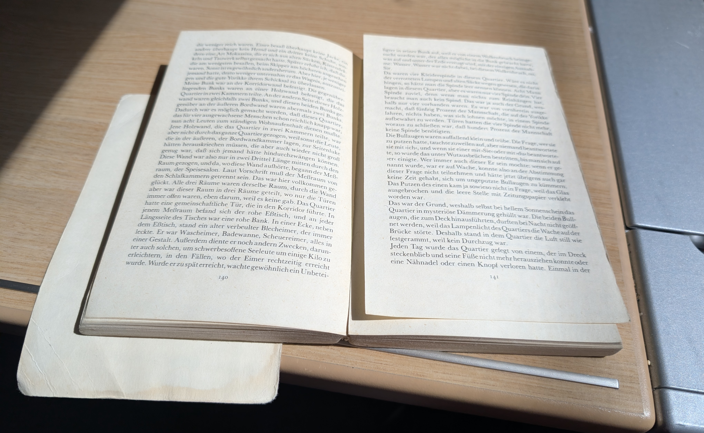
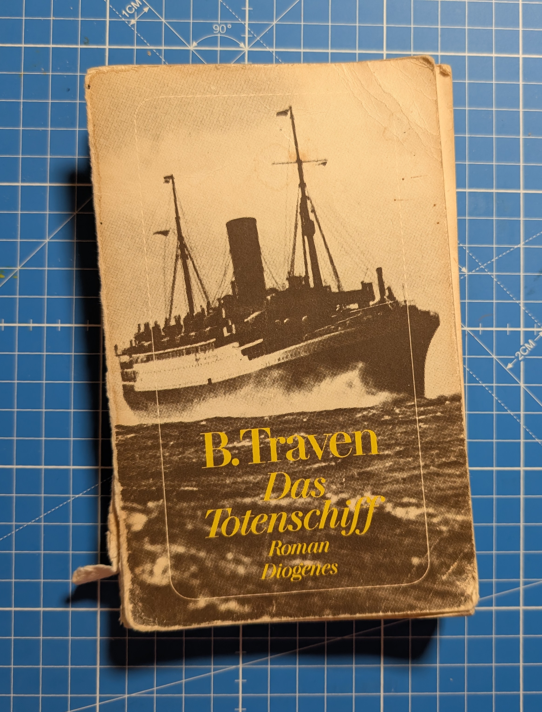
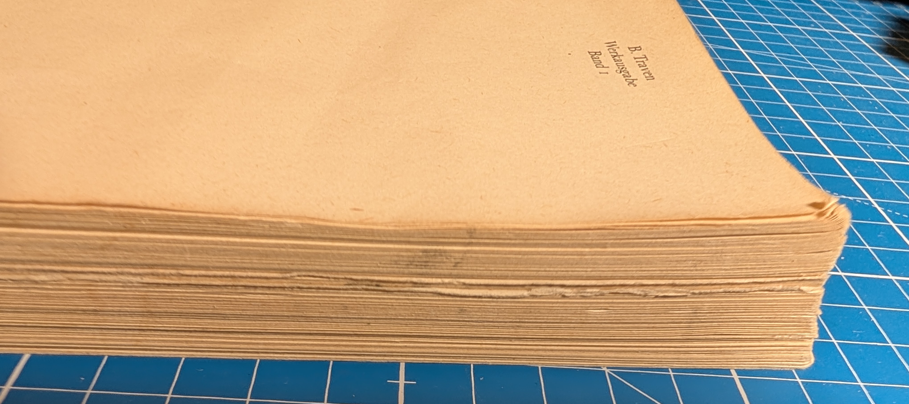
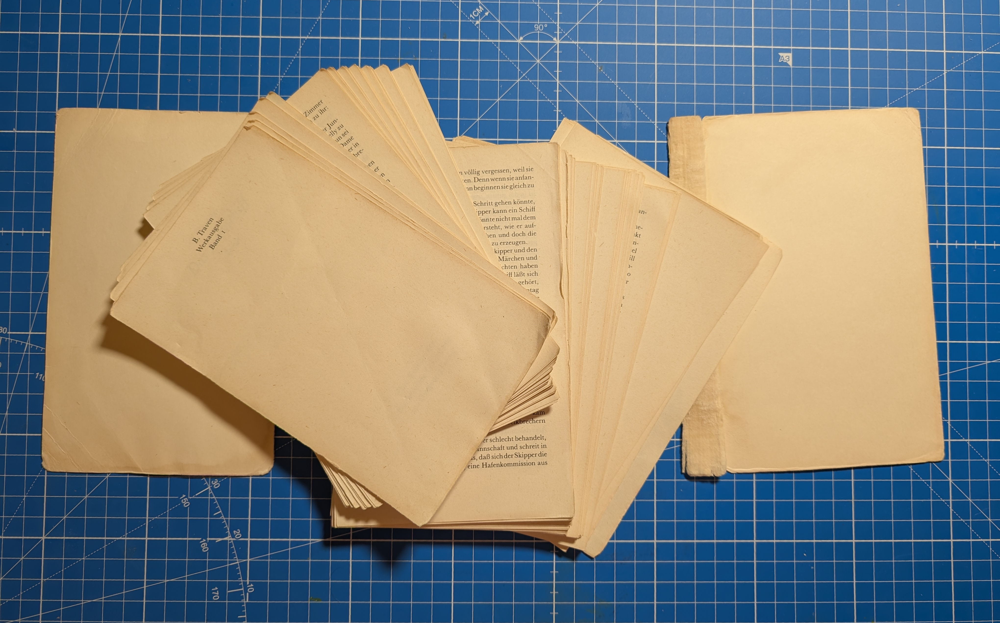
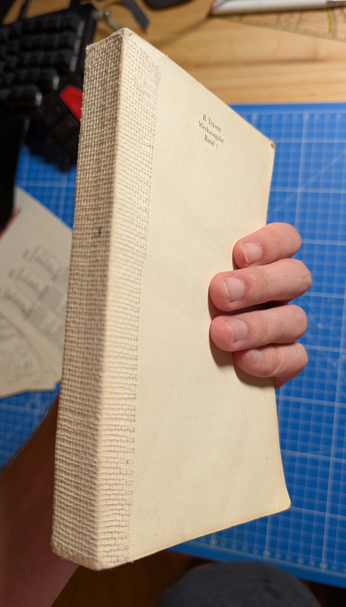
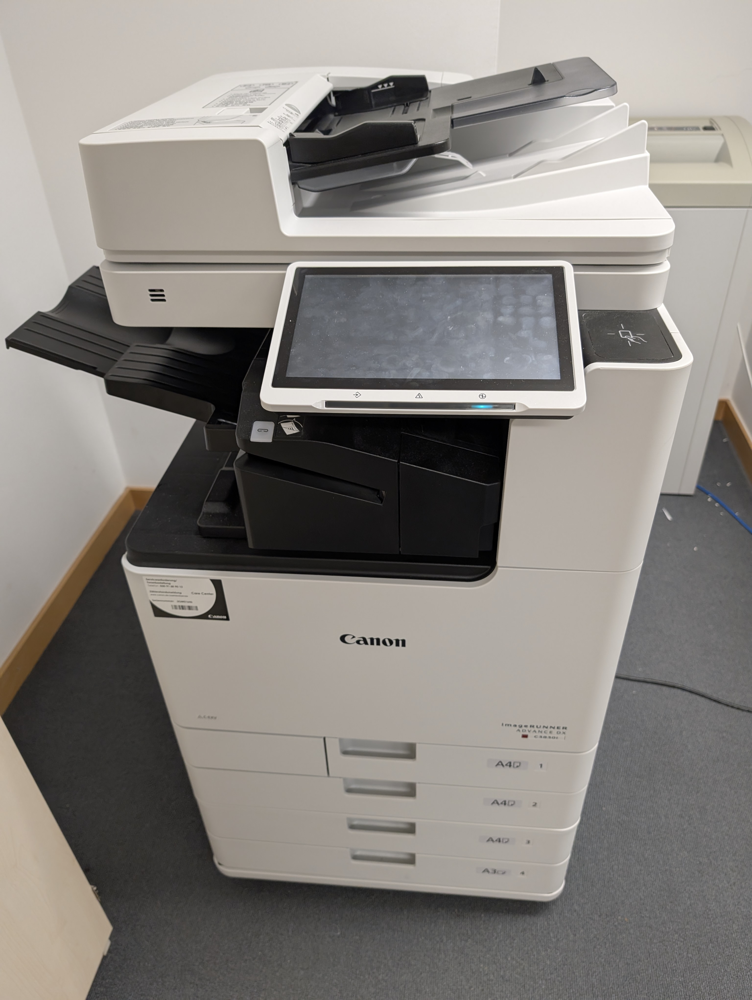
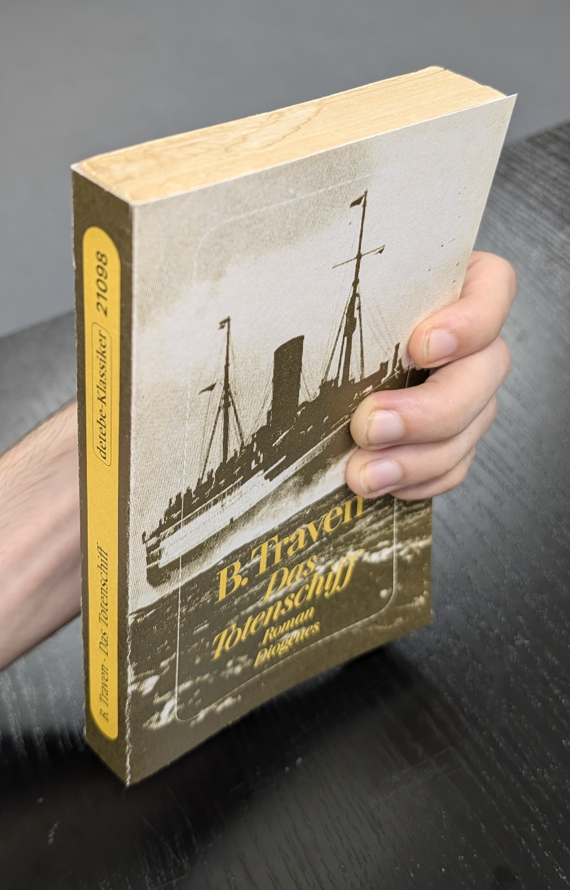
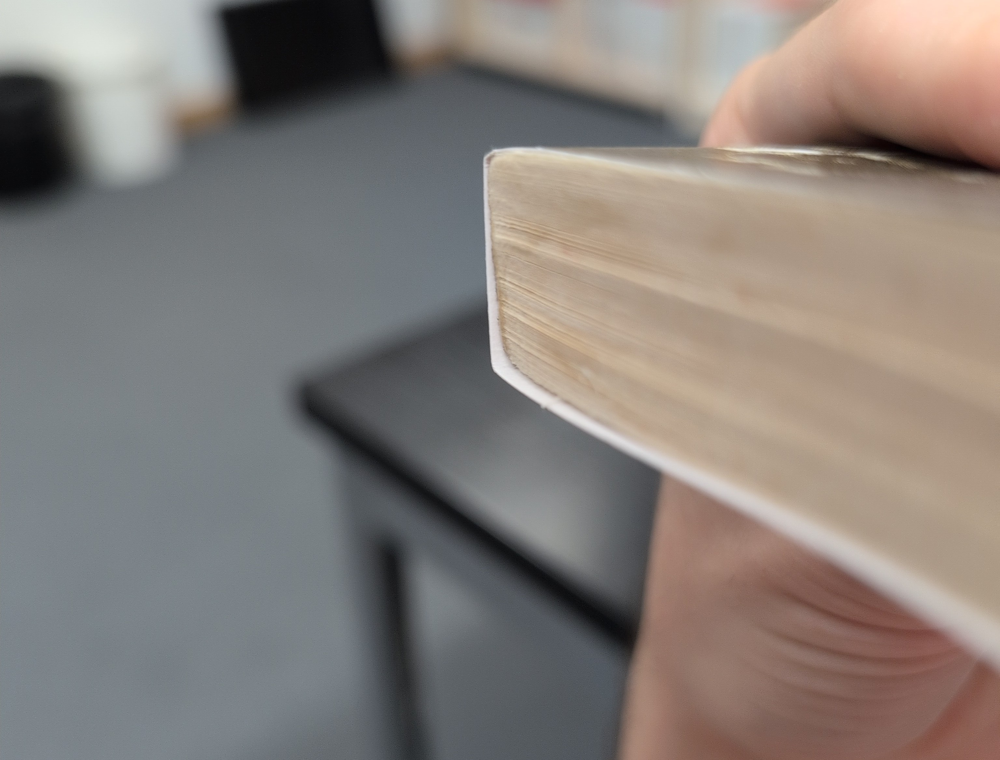
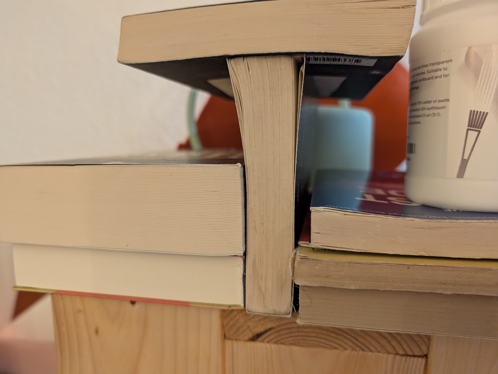
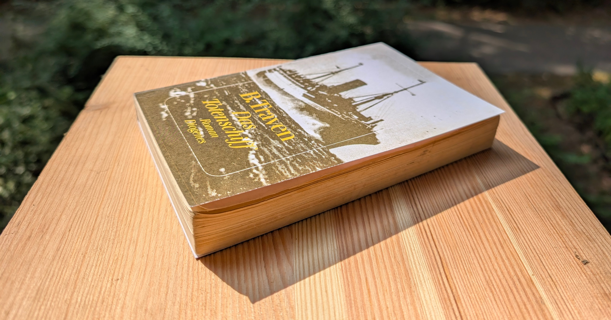

# I bound a book

## It was surprisingly straightforward

Recently, my sister lent me "Das Totenschiff", her favorite book.
She had bought it second (or third?) hand, so you had to be careful not to forget parts when traveling.

While a worn-out book has some charme, this one was *very* worn out.
The front cover was a loose paper and several pages were not attached to the spine at all.
I asked her if I could try rebinding the book and she agreed.

Looking at the side, you can see that the loose pages stick out a little bit, which increases the propability of them getting crumpled.

Following a wonderful [YouTube tutorial from The Huntington](https://www.youtube.com/watch?v=VFtUjS63XUI), I took the book apart.

Using some weight, I pressed down the pages together over night so they are nice and tidy.
I clamped the block of pages between two wood blocks and painted book glue on the spine.
For extra stability, I also added some book spine webbing, which I found at the craft supply store when I bought the glue.

Next: The cover.
I scanned the original, imported it to Procreate, aligned the scans, cleaned up the scratches, and extended the halftone dot pattern to the worn-out corners (a repetitive, but relaxing activity).

At university, we have industrial printers that you can use to print on thick 250g/m² paper.

After some trial and error on normal paper (the printer likes to add padding), I managed to print out a version in the correct size.
Sadly, the black is not pure black – apparently, the toner printer struggled applying consistent colors on such thick paper – but at least it retains some of the off-black worn-out look from the original.

I cut the cover using a cutting machine and when holding it to the book block, already looks like a real book again.

At this point, I discovered that the book block has a slight slant; the back pages are higher than the front ones.
I tried rebinding the pages again, but the book glue really works and makes it near impossible to separate pages without the risk of tearing them apart.
Well.
At least it's only a slight slant.

Applying the cover took some more glue and a night of cuddling with some other books.

So, here's the final result:

