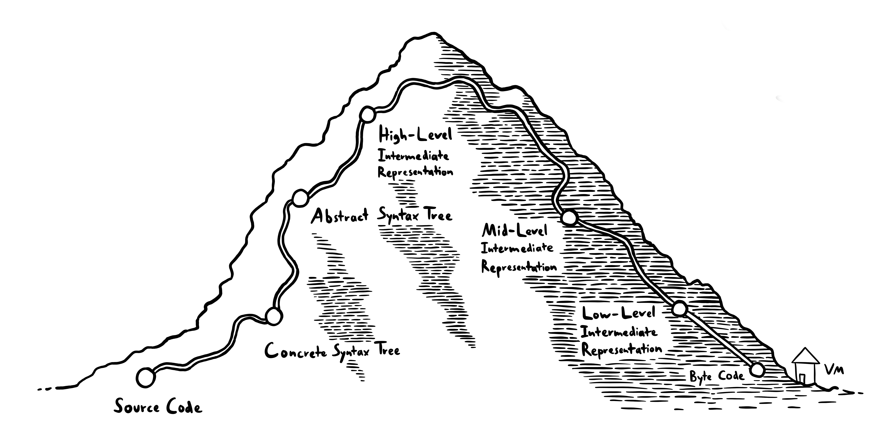

topics = [ "programming language design", "code" ]
description = "How the Candy compiler transforms source code into byte code."

--start--

# The Candy Compiler Pipeline

> See the [previous article](candy) for an introduction to Candy, a new programming language.

An interesting property of Candy is that every time your program panics, a single call site can be made responsible.
This is a necessary to enable good tooling using fuzzing – for found crashes, the faulty call site can be highlighted in the IDE.

From a compiler-building perspective, this also makes the Candy compiler quite unique.
In this article, I'll show a general outline of the different compilation stages.



--snip--

## Source Code

We start with source code.
Source code is stored as UTF-8 encoded bytes.

As an example, we'll look at the following file.
It exports a function `inc`, which increases the given integer by one:

```candy
[int] = use "Core"
[add] = int

inc a :=
  needs (int.is a)
  add a 1
```

## Concrete Syntax Tree (CST)

The first step is a parser, which converts the string of characters into a tree.
This so-called Concrete Syntax Tree (or CST) contains all information about the original source code – every comment, every whitespace, even sections of the code that could not be parsed.

The CST can be converted back to original source code and is heavily used for tools such as syntax highlighting or code formatting.

This is the CST for the code above:

```rust
... // the `use`
Newline("\n")
... // the destructuring into `add`
Newline("\n")
Newline("\n")
Assignment {
  left: TrailingWhitespace {
    child: Call {
      receiver: TrailingWhitespace { child: Identifier("inc"), whitespace: [Whitespace(" ")] },
      arguments: [Identifier("a")]
    },
    whitespace: [Whitespace(" ")]
  },
  assignment_sign: TrailingWhitespace {
    child: ColonEqualsSign,
    whitespace: [Newline("\n"), Whitespace("  ")]
  },
  body: [
    Call {
      receiver: TrailingWhitespace { child: Identifier("needs"), whitespace: [Whitespace(" ")] },
      arguments: [Parenthesized {
        opening_parenthesis: OpeningParenthesis,
        inner: Call {
          receiver: TrailingWhitespace {
            child: StructAccess { struct_: Identifier("int"), dot: Dot, key: Identifier("is") },
            whitespace: [Whitespace(" ")]
          },
          arguments: [Identifier("a")]
        },
        closing_parenthesis: ClosingParenthesis
      }]
    },
    Newline("\n"),
    Whitespace("  "),
    Call {
      receiver: TrailingWhitespace { child: Identifier("add"), whitespace: [Whitespace(" ")] },
      arguments: [
        TrailingWhitespace { child: Identifier("a"), whitespace: [Whitespace(" ")] },
        Int { value: 1, string: "1" }
      ]
    }
  ]
}
Newline("\n")
```

The parser is perhaps the most complicated part of the compilation pipeline because it bridges a very large abstraction gap – all other stages just convert one tree into another, simpler tree.

The parser basically consists of a bunch of functions that look like this:

```rust
fn opening_parenthesis(input: &str) -> Option<(&str, Cst)> {
  let input = input.strip_prefix("(")?;
  Some(input, CstKind::OpeningParenthesis.into())
}
```

They take an input and try to find a specific pattern at the beginning of the string.
In this case, the function looks for an opening parenthesis `candy:(`.
If it doesn't find a parenthesis, it returns `rust:None`.
Otherwise, it returns a tuple of the unparsed, remaining part of the string as well as the parsed part.

```rust
opening_parenthesis("(abc") -> Some(("abc", OpeningParenthesis))
opening_parenthesis("abc") -> None
```

More complicated parsers are built from these simpler ones.
These get pretty complicated pretty quickly.
For example, you might think parsing a parenthesized expression such as `candy:(4)` is easy – just parse an opening parenthesis, parse the expression, then parse a closing parenthesis.

But will it handle all these edge cases correctly?

```candy
( # comment
  3
  # another comment
)

(4  # missing closing parenthesis

()  # missing expression
```

You might think these are extreme edge cases not worth caring about, but the parser is a fundamental part of the tooling that lots of other parts use – for example syntax highlighting.
In pratice, the parser runs each time you enter a character into a Candy file, so it needs to be very robust and handle unfinished code gracefully.

Here's the actual parser for parenthesized expressions:

```rust
fn parenthesized(input: &str, indentation: usize) -> Option<(&str, Rcst)> {
  let (input, opening_parenthesis) = opening_parenthesis(input)?;

  let (input, whitespace) = whitespaces_and_newlines(input, indentation + 1, true);
  let inner_indentation = if whitespace.is_multiline() {
      indentation + 1
  } else {
      indentation
  };
  let opening_parenthesis = opening_parenthesis.wrap_in_whitespace(whitespace);

  let (input, inner) = expression(input, inner_indentation, false, true, true).unwrap_or((
      input,
      CstKind::Error {
          unparsable_input: "".to_string(),
          error: CstError::OpeningParenthesisMissesExpression,
      }
      .into(),
  ));

  let (input, whitespace) = whitespaces_and_newlines(input, indentation, true);
  let inner = inner.wrap_in_whitespace(whitespace);

  let (input, closing_parenthesis) = closing_parenthesis(input).unwrap_or((
      input,
      CstKind::Error {
          unparsable_input: "".to_string(),
          error: CstError::ParenthesisNotClosed,
      }
      .into(),
  ));

  Some((
      input,
      CstKind::Parenthesized {
          opening_parenthesis: Box::new(opening_parenthesis),
          inner: Box::new(inner),
          closing_parenthesis: Box::new(closing_parenthesis),
      }
      .into(),
  ))
}
```

Even unfinished code is parsed into a somewhat correct tree that contains error nodes when something is wrong:

```rust
parenthesized(0, "(abc)") -> Some(("", Parenthesized {
  opening_parenthesis: OpeningParenthesis,
  inner: Identifier("abc"),
  closing_parenthesis: ClosingParenthesis,
}))

parenthesized(0, "abc") -> None

parenthesized(0, "()") -> Some(("", Parenthesized {
  opening_parenthesis: OpeningParenthesis,
  inner: Error(OpeningParenthesisMissesExpression),
  closing_parenthesis: ClosingParenthesis,
}))

parenthesized(0, "(a") -> Some(("", Parenthesized {
  opening_parenthesis: OpeningParenthesis,
  inner: Identifier("a"),
  closing_parenthesis: Error(ParenthesisNotClosed),
}))
```

An interesting property about Candy in particular is that indentation is more important to the parser than any form of parentheses.
This makes parsers *even more complicated* in some places, but it guarantees that invalid stuff in your code can only have local effects:

```candy
foo a =
  fds))){

# still parsed correctly
bar a =
  ...
```

As you might imagine, writing robust parsers takes some effort.
Our complete parser file contains over 3000 lines (although many of those lines are also dedicated to unit tests).
The result is worth it though – a robust parser that works even with unfinished code.

## Abstract Syntax Tree (AST)

In the next stage, the Abstract Syntax Tree (AST), lots of information that's uninteresting for later stages is removed.
In particular, all whitespace and comments are gone.
That makes the next stages easier to implement.

```
assignment: struct
  identifier $6@"int" = 
  call identifier $0@"use" with these arguments:
    text
      textPart $2@"Core"
assignment: struct
  identifier $12@"add" = 
  identifier $10@"int"
assignment: $32@"inc" := function (fuzzable) { $33@"a" ->
  call identifier $16@"needs" with these arguments:
    call struct access identifier $18@"int".$20@"Is" with these arguments:
      identifier $22@"a"
  call identifier $26@"add" with these arguments:
    identifier $28@"a"
    int 1
}
```

As you see, some syntax peculiarieties are also desugured.
In the CST, the `inc a := ...` definition was parsed as an assignment with a call on the left side.
In the AST, it's instead converted to a definition of a function with an `a` parameter.

## High-Level Intermediary Representation (HIR)

Deeply nested expressions are something computers don't natively understand.
That's why we now turn expressions such as `needs (int.is a)`, into a sequence of simple operations:

1. Look up the `Is` function from the `int` struct
2. Call the function
3. Call `needs` with the result

Because we need to introduce local temporary variables for the intermediary results, this is also a nice opportunity to track which variable names are in scope and relate those names to one another.

The compiler creates this flattened structure by going over the AST recursively and outputting finished expressions into a `Context`.
For example, to compile the HIR code for a `List`, it first compiles the code for all the list items (which can be complicated expressions themselves) and then creates a list expression which references them.

```rust
impl Context<'_> {
  fn compile(&mut self, asts: &[Ast]) -> hir::Id { ... }

  // Adds generated code to `self`, returns the ID of the resulting expression.
  fn compile_single(&mut self, ast: &Ast) -> hir::Id {
    match &ast.kind {
      AstKind::Int(Int(int)) => {
          self.push(Some(ast.id.clone()), Expression::Int(int.to_owned()), None)
      }
      AstKind::Identifier(Identifier(name)) => {
          let reference = match self.identifiers.get(&name.value) {
              Some(reference) => reference.to_owned(),
              None => return self.push_error(...),
          };
          self.push(Some(ast.id.clone()), Expression::Reference(reference), None)
      }
      AstKind::List(List(items)) => {
          let hir_items = items
              .iter()
              .map(|item| self.compile_single(item))
              .collect_vec();
          self.push(Some(ast.id.clone()), Expression::List(hir_items), None)
      }
      ...
  }
}
```

There are two more things to note:

- The compiler implicitly generates a `use` function at the beginning, which can import other modules.
- Each struct access such as `int.is` gets converted into a call of the `structGet` builtin.
  In the end, everything is just calls all the way down.

This is the HIR for our file from above:

```candy
$use = { (non-fuzzable) $use:relativePath ->
  $use:importedModule = relative to module Examples:playground, use $use:relativePath
}
$0 = $use
$1 = builtinTextConcatenate
$2 = builtinTypeOf
$3 = Text
$4 = builtinEquals
$5 = builtinIfElse
$6 = builtinToDebugText
$7 = "Core"
$8 = call $0 with $7
$9 = destructure $8 into [Int: p$0]
$int = p$0
$10 = Nothing
$11 = $int
$12 = destructure $11 into [Add: p$0]
$add = p$0
$13 = Nothing
$inc = { (fuzzable) $inc:a ->
  $inc:0 = "Builtins"
  $inc:1 = call $use with $inc:0
  $inc:2 = builtinStructGet
  $inc:3 = StructGet
  $inc:4 = call $inc:2 with $inc:1 $inc:3
  $inc:5 = $int
  $inc:6 = Is
  $inc:7 = call $inc:4 with $inc:5 $inc:6
  $inc:8 = $inc:a
  $inc:9 = call $inc:7 with $inc:8
  $inc:10 = "`int.is a` was not satisfied"
  $inc:11 = needs $inc:9 with reason $inc:10
  $inc:12 = $add
  $inc:13 = $inc:a
  $inc:14 = 1
  $inc:15 = call $inc:12 with $inc:13 $inc:14
}
$inc#1 = $inc
$14 = Inc
$15 = [$14: $inc#1]
```

## Mid-Level Intermediate Representation (MIR)

You might have noted that `needs` are not normal calls in the HIR.
That's because they are a feature unique to Candy in that they also attribute fault to a responsible piece of code when they fail.
You can read the [previous article](candy) for more information about why needs behave slightly different from functions.

In the MIR, the responsible pieces of code are handled explicitly – there's a new type of value, a `HirId`, which is passed around just like all the other values.
Each function gets an additional parameter, the `HirId` of the code that's responsible for fulfilling the `needs` in the function.

With that in place, `needs` can now be converted to normal function calls.

```
# functions have an extra parameter for who's responsible for fulfilling needs
$0 = { $1 (+ responsible $2)
  ...
}

# A call such as `foo "hi"` becomes this:
$3 = "hi"
$4 = example:bar  # where foo is called
$5 = call $0 $3 ($4 responsible)
```

That also means that the compiler defines a `needs` function at the beginning of the MIR.
Here's the MIR code for our example:

```
# anonymous:$generated::needs
$49 = { $2 $3 $4 (+ responsible $1) ->
  $5 = anonymous:$generated::needs
  $6 = builtinEquals
  $7 = Nothing
  $8 = True
  $9 = False
  $10 = call $6 with $2 $8 ($5 is responsible)
  $11 = builtinIfElse
  # anonymous:$generated::needs:isConditionTrue:then
  $14 = { (responsible $12) ->
    $13 = $8
  }
  # anonymous:$generated::needs:isConditionTrue:else
  $17 = { (responsible $15) ->
    $16 = call $6 with $2 $9 ($5 is responsible)
  }
  $18 = call $11 with $10 $14 $17 ($5 is responsible)
  $19 = builtinIfElse
  # anonymous:$generated::needs:isConditionBool:then
  $22 = { (responsible $20) ->
    $21 = $7
  }
  # anonymous:$generated::needs:isConditionBool:else
  $26 = { (responsible $23) ->
    $24 = "The `condition` must be either `True` or `False`."
    $25 = panicking because $24 ($1 is at fault)
  }
  $27 = call $19 with $18 $22 $26 ($5 is responsible)
  $28 = builtinTypeOf
  $29 = call $28 with $3 ($1 is responsible)
  $30 = Text
  $31 = call $6 with $29 $30 ($1 is responsible)
  $32 = builtinIfElse
  # anonymous:$generated::needs:isReasonText:then
  $35 = { (responsible $33) ->
    $34 = $7
  }
  # anonymous:$generated::needs:isReasonText:else
  $39 = { (responsible $36) ->
    $37 = "The `reason` must be a text."
    $38 = panicking because $37 ($1 is at fault)
  }
  $40 = call $32 with $31 $35 $39 ($5 is responsible)
  $41 = builtinIfElse
  # anonymous:$generated::needs:condition:then
  $44 = { (responsible $42) ->
    $43 = $7
  }
  # anonymous:$generated::needs:condition:else
  $47 = { (responsible $45) ->
    $46 = panicking because $3 ($4 is at fault)
  }
  $48 = call $41 with $2 $44 $47 ($5 is responsible)
}
$50 = Examples:playground:
# Examples:playground:use
$54 = { $52 (+ responsible $51) ->
  $53 = use $52 (relative to Examples:playground; $50 is responsible)
}
...
# Examples:playground:inc
$270 = { $247 (+ responsible $246) ->
  $248 = "Builtins"
  $249 = Examples:playground:inc:1
  $250 = call $54 with $248 ($249 is responsible)
  $251 = builtinStructGet
  $252 = StructGet
  $253 = Examples:playground:inc:4
  $254 = call $251 with $250 $252 ($253 is responsible)
  $255 = $153
  $256 = Is
  $257 = Examples:playground:inc:7
  $258 = call $254 with $255 $256 ($257 is responsible)
  $259 = $247
  $260 = Examples:playground:inc:9
  $261 = call $258 with $259 ($260 is responsible)
  $262 = "`int.is a` was not satisfied"
  $263 = Examples:playground:inc:11
  $264 = call $49 with $261 $262 $246 ($263 is responsible)
  $265 = $244
  $266 = $247
  $267 = 1
  $268 = Examples:playground:inc:15
  $269 = call $265 with $266 $267 ($268 is responsible)
}
$271 = $270
$272 = Inc
$273 = [$272: $271]
```

Also notable is that pattern destructuring gets converted into a bunch of `candy:ifElse` calls, but I'll skip a more detailed explanation here.

## Optimizing the MIR

Of course, code like this is horribly inefficient.
That's why we also apply several optimizations on the MIR.
These are the most important ones:

- **Module Folding**:
  When there's a `candy:use`, we compile the corresponding file and input its code right here.
  The exports from the file are put in a struct.

- **Constant Folding**:
  When the result of a call of a builtin function can be already determined at compile-time, we inline the result right away.
  For example, when using `candy:int.is` to get the `candy:is` function from the `candy:int` module, we know the arguments to the generated `candy:structGet` call – we know all the exports of the `candy:int` module and we know that you look for the `candy:is` key.
  So, rather than executing that lookup during runtime, we replace it with a direct reference to the function.

- **Tree Shaking**:
  If the result of a calculation is not used, it can be removed.
  This happens quite frequently.
  For example, when you import the `Core` library, but only use a fraction of the functions, we only keep those around.

- **Constant Lifting**:
  If you have a function that creates lots of local variables (such as numbers, or `candy:True`, or `candy:False`), it's very likely that other functions use the same values.
  In that case, we move the value defintions out of the functions so that they don't need to create new objects on the heap every time they are called.

- **Common Subtree Elimination**:
  When constants are lifted into an outer scope, it's likely that the same constants may appear multiple times.
  We only keep one of them around.

- **Inlining**:
  Calls to other functions may be replaced with the function's code.
  We do that if the called function is very small.
  In the future, we probably need some better heuristics here; when done correctly, inlining is has the potential to enable the application of other optimizations.

This is the MIR with optimizations applied (note there's still lots of optimization potential):

```
...
# anonymous:$generated::needs:isConditionTrue:then
$25 = { (responsible $26) ->
  $27 = $19
}
# anonymous:$generated::needs:isConditionBool:then
$28 = { (responsible $29) ->
  $30 = $17
}
# anonymous:$generated::needs
$31 = { $32 $33 $34 (+ responsible $35) ->
  $36 = call $10 with $32 $19 ($9 is responsible)
  # anonymous:$generated::needs:isConditionTrue:else
  $37 = { (responsible $38) ->
    $39 = call $10 with $32 $14 ($9 is responsible)
  }
  $40 = call $11 with $36 $25 $37 ($9 is responsible)
  # anonymous:$generated::needs:isConditionBool:else
  $41 = { (responsible $42) ->
    $43 = panicking because $21 ($35 is at fault)
  }
  $44 = call $11 with $40 $28 $41 ($9 is responsible)
  $45 = call $13 with $33 ($35 is responsible)
  $46 = call $10 with $45 $18 ($35 is responsible)
  # anonymous:$generated::needs:isReasonText:else
  $47 = { (responsible $48) ->
    $49 = panicking because $22 ($35 is at fault)
  }
  $50 = call $11 with $46 $28 $47 ($9 is responsible)
  # anonymous:$generated::needs:condition:else
  $51 = { (responsible $52) ->
    $53 = panicking because $33 ($34 is at fault)
  }
  $54 = call $11 with $32 $28 $51 ($9 is responsible)
}
# Examples:playground:inc
$55 = { $56 (+ responsible $57) ->
  $58 = call $13 with $56 ($6 is responsible)
  $59 = call $10 with $58 $16 ($1 is responsible)
  $60 = call $31 with $59 $24 $57 ($7 is responsible)
  $61 = call $13 with $56 ($4 is responsible)
  $62 = call $10 with $61 $16 ($5 is responsible)
  $63 = call $31 with $62 $23 $8 ($3 is responsible)
  $64 = call $12 with $56 $20 ($2 is responsible)
}
$65 = [$15: $55]
```

## Low-Level Intermediate Representation

While the MIR is already quite low-level, it still contains nested functions.
Nested functions are necessary because they can *close over* (or *capture*) values from the outer scope.
For example, check out the following function:

```candy
foo a = { b -> int.add a b }
```

Here, `candy:foo 4` returns a function that always adds `candy:4` to its argument.
Thus, the `candy:a` needs to continue existing even after `candy:foo` returns.

In the next compiler stage, those **captured variables** are explicitly tracked.
That also enables un-nesting functions.

Technically, functions also capture all used other functions.
To make that easier, the next IR also tracks which values are constants – they don't need to be explicitly captured.

Candy uses reference counting for garbage collection.
The operations for increasing and decreasing the reference cout of objects also also explicit in the LIR as `dup` and `drop`.

This is the LIR for our file:

```
# Constants
%0 = Builtins::equals:6
...
%13 = False
...
%27 = { body_7 }
%28 = [%14: %27]

# Bodies
...
body_7 $0 (+ responsible $1) =
  # Captured IDs: none
  $2 = dup $0 by 2
  $3 = %12
  $4 = %5
  $5 = call $3 with $0 ($4 is responsible)
  $6 = %9
  $7 = %15
  $8 = %0
  $9 = call $6 with $5 $7 ($8 is responsible)
  $10 = %26
  $11 = %23
  $12 = %6
  $13 = call $10 with $9 $11 $1 ($12 is responsible)
  $14 = %3
  $15 = call $3 with $0 ($14 is responsible)
  $16 = %4
  $17 = call $6 with $15 $7 ($16 is responsible)
  $18 = %22
  $19 = %7
  $20 = %2
  $21 = call $10 with $17 $18 $19 ($20 is responsible)
  $22 = %11
  $23 = %19
  $24 = %1
  $25 = call $22 with $0 $23 ($24 is responsible)
  $26 = $25
  $27 = drop $15
  $28 = drop $26
...
```

## Byte Code

Finally, the LIR is translated into Byte Code for the Candy VM.

Constant objects are actually created in memory.

Instead of functions with code, there only exists a single `Vec` of instructions.
The VM maintains an instruction pointer, an index into that vector.

Because the VM is stack-based, there are lots of operations for pushing objects to and popping elements from the stack:

```
# Constant heap
0x55ed48b44300: "Error"
...
0x55ed4686efc0: "Main"
...
0x55ed48ed9120: "`int.is a` was not satisfied"
...

# Instructions
...
# Examples:playground:inc
 73: pushConstant inline builtinTypeOf
 74: pushFromStack 2
 75: pushConstant 0x55ed48be8e00 Builtins::typeOf:5
 76: call with 1 argument
 77: pushConstant inline builtinEquals
 78: pushFromStack 1
 79: pushConstant inline Int
 ...
 97: pushConstant 0x55ed473716d0 { 3 arguments (capturing nothing) → ip-26 }
 98: pushFromStack 1
 99: pushConstant 0x55ed4686b1a0 "`a | typeIs Int` was not satisfied"
100: pushConstant 0x55ed46a39880 Examples:playground:inc:15
101: pushConstant 0x55ed468a8f80 Builtins::intAdd:5
102: call with 3 arguments
103: pushConstant inline builtinIntAdd
104: pushFromStack 8
105: pushConstant inline 1
106: pushConstant 0x55ed468ac1b0 Builtins::intAdd:18
107: tailCall with 8 locals and 2 arguments
...
```

You made it!
