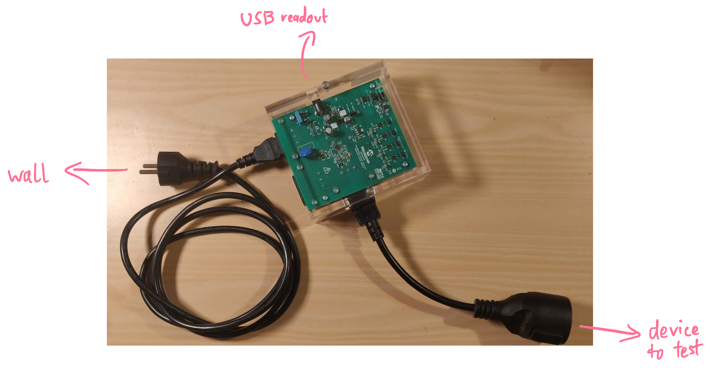
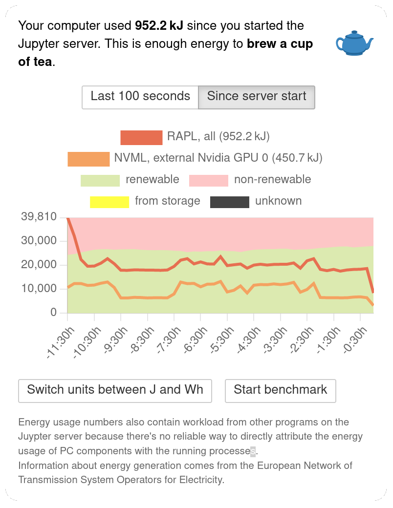
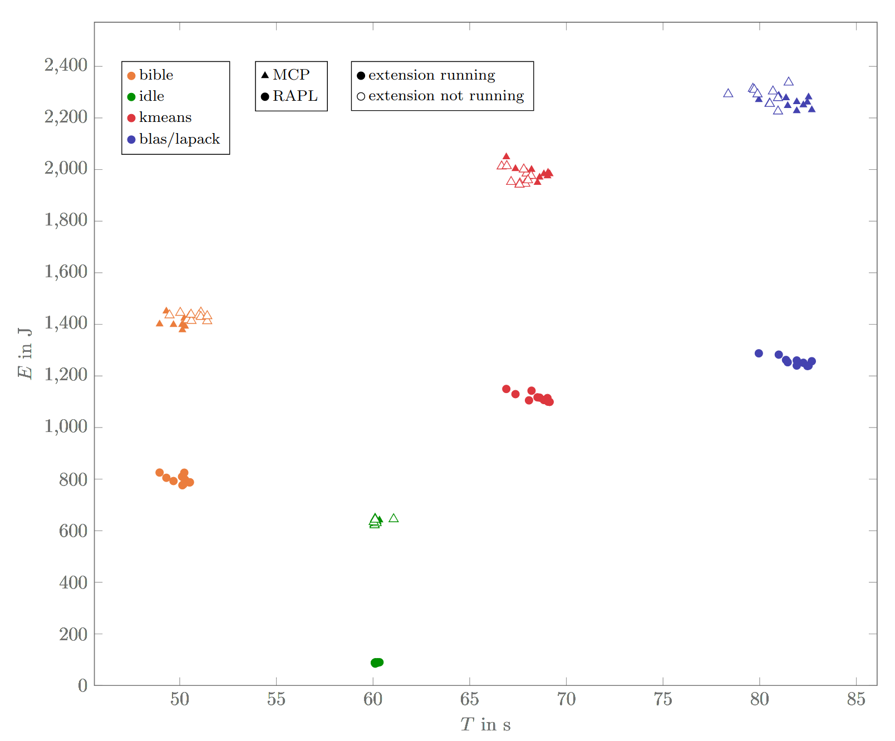

# Increasing Awareness of Energy Consumption in Jupyter Notebooks

[Jupyter Notebooks](https://jupyter.org) are becoming an increasingly popular tool: These Python-based notebooks run in your browser and combine running code with writing explanatory documentation.
Notebooks have a client-server architecture – even if your notebook runs on a powerful machine, you can still write your code on a light endpoint, such as a laptop.
While free Jupyter Notebook services such as [Google Colab](https://colab.research.google.com) make computing-intensive research fields more accessible to a general audience, they also hide the amount of power that is consumed in the background; if you program on your laptop, you might not even notice that the actual computing part requires a significant amount resources in a data center.
It doesn't help that Jupyter Notebooks are most commonly used in data science and Machine Learning, two of the most power-hungry disciplines.
That's why, in my last semester, I developed [an extension](https://github.com/MarcelGarus/jupyter-energy) for Jupyter Notebooks that alerts you of your energy consumption.

The most similar extension is called [jupyter-resource-usage](https://github.com/jupyter-server/jupyter-resource-usage) and uses [`psutil`](https://pypi.org/project/psutil) to retrieve data from the kernel infrastructure.
That allows it to monitor RAM and CPU usage, but other resources are not supported – [not even GPUs,](https://github.com/jupyter-server/jupyter-resource-usage/issues/12) which play a big part in training Machine Learning models.

## Getting the energy consumption

Unfortunately, there is no established unified way of getting information about energy consumption from the kernel.
Inspired by [pinpoint](https://github.com/osmhpi/pinpoint), an energy measurement tool developed at the [*Operating Systems and Middleware* chair](https://osm.hpi.de) at my university, I implemented getting data from several sources:

### Running Average Power Limit

Linux offers a *Running Average Power Limit* (RAPL for short) on x86_64 CPUs.
This allows tracking the power consumption of *CPU components,* such as the CPU, RAM, or builtin GPU.
Notably, external components like external graphic cards, connected peripherals, etc. are not included.

On Linux, for each trackable metric, there are several files in `/sys/bus/event_source/devices/power/events`. For example, on my Laptop the following files exist:

```bash
marcel@marcel-laptop:/sys/bus/event_source/devices/power/events$ ls
energy-cores        energy-gpu        energy-pkg        energy-psys        energy-ram
energy-cores.scale  energy-gpu.scale  energy-pkg.scale  energy-psys.scale  energy-ram.scale
energy-cores.unit   energy-gpu.unit   energy-pkg.unit   energy-psys.unit   energy-ram.unit
```

According to the [Linux source code](https://github.com/torvalds/linux/blob/a19944809fe9942e6a96292490717904d0690c21/arch/x86/events/rapl.c), these correspond to the following sources:

- `energy-cores`: all physical cores
- `energy-gpu`: the builtin GPU
- `energy-pkg`: the whole processor package
- `energy-psys`: the builtin psys domain
- `energy-ram`: the RAM component

For each source, there are three files:

- `.../<event>`: A file containing a hexadecimal event code. For example, my `energy-cores` file contains `event=0x01`.
- `.../<event>.scale`: A file containing a scaling factor. On my laptop, the `energy-cores.scale` file contains `2.3283064365386962890625e-10`.
- `.../<event>.unit`: A file containing the unit in which the energy consumption is measured. Usually, this will be `Joules`.

These contents can be used to make the Linux kernel measure how much energy the sources use. In particular, you can perform a `perf_event_open` syscall with the event code. This will return a file handle that contains an *event counter* for that event – that's just a number that you can multiply by the scale to get the energy consumption in the given unit.

Here's how a minimal C program looks like that measures the energy consumption of a component:

```c
struct perf_event_attr attr;  // perf_event_attr from #include <linux/perf_event.h>
memset(&attr, 0, sizeof(attr));
attr.type   = type;   // type from /sys/bus/event_source/devices/power/type
attr.size   = sizeof(attr);
attr.config = config; // config from /sys/bus/event_source/devices/power/events/<event>

long fd = syscall(
    __NR_perf_event_open, // perf_event_open syscall
    &attr,
    -1, // restricting to a pid is not supported
    0,  // not running on a particular cpu
    -1, // group_fd is not supported
    0   // no flags
);

long int counter_before;
read(fd, &counter_before, sizeof(long int));

sleep(10);

long int counter_after;
read(fd, &counter_after, sizeof(long int));

close(fd); // stops measuring

// scale from /sys/bus/event_source/devices/power/events/<event>.scale
double used_energy = (double)(counter_after - counter_before) * scale;

// unit from /sys/bus/event_source/devices/power/events/<event>.unit
printf("In 10 seconds, you used %0.3f %s.\n", used_energy, unit);
// "In 10 seconds, you used 3.458 Joules."
```

### MCP

The Operating Systems and Middleware chair has a *Microchip MCP39F511N Power Monitor* (which we just call MCP).
That's actual physical hardware that you can plug between the wall socket and the computer.
It then measures the power consumption of the entire system with all components, including external peripherals like connected displays, disks, or USB drives.
Here's a photo:



As soon as you connect the MCP's USB port to a PC, it will appear at `/dev/ttyACM0` (or with a higher number at the end).
Pinpoint contains a [small C library](https://github.com/osmhpi/pinpoint/blob/72d303313eb0425cf066346b56034e219d94a74a/src/data_sources/mcp_com.c) for communicating with the MCP over this serial interface – the protocol it uses is defined [in the MCP's datasheet.](https://ww1.microchip.com/downloads/en/DeviceDoc/20005473B.pdf)
A basic energy readout looks like this:

```c
long fd = f511_init("/dev/ttyACM0");

int data[2]; // The MCP has two outlets where you can measure.
int result = f511_get_power(&data[0], &data[1], fd);

close(fd);

// The MCP returns the current power consumption in 10mW steps.
double watts = 0.01 * (double)data[0];
printf("The MCP's first channel is currently drawing %0.3f watts.\n", watts);
```

Contrary to the RAPL, the MCP only reports the current power draw instead of a cumulative measure.
Therefore, to get accurate measurements of how much energy long-running task consume, you need to continuously ask the MCP for power draws and calculate an integral over those values.

### NVML

Finally, I looked at the *Nvidia Management Library* (also called NVML).
In Python, the `py3nvml` package allows us to request the self-reported energy usage of Nvidia GPUs:

```python
from py3nvml import py3nvml as nvml

device = nvml.nvmlDeviceGetHandleByIndex(gpu_index)
watts = nvml.nvmlDeviceGetPowerUsage(device) / 1000
```

It doesn't get much easier than this!

## Building an Extension

Now that we know how to get the energy from several sources, we need to somehow integrate that information in Jupyter Notebooks.
Those support two types of extensions:

- **server extension:** These types of extensions run in the Juypter Notebook process itself – that's the process on the machine that actually executes the Python code. Because the Jupyter Notebook server is written in Python, those are installed as Python modules.
- **notebook extension:** These types of extensions run in the frontend. They are written in JavaScript and can interact with the notebook in the same way that the user can.

To record the energy data and display it, we need both types of extensions.
I took the Jupyter Resource Usage extension as a reference, which also uses this approach.
One difference to that extension is that the `perf_event_open` syscall can only be executed as root, unless you change `proc/sys/kernel/perf_event_paranoid` to allow more processes to listen for hardware events.
That's why I put the energy data gathering in a separate process, which I call the *energy server* – this separation allows the energy server to run as root without also running the Jupyter Notebook server as root (and thereby all the code written inside notebooks).

The energy server aggregates energy consumption data from multiple sources, saving both a short-term history of the power draw as well as a long-term recording of the energy usage.
It communicates with sources in different ways: Accessing the RAPL and the MCP works best in C, so I wrote small C wrappers that can be compiled into a shared libraries (with something like `gcc --shared rapl.c -o rapl.so`). The energy server written in Python can then call the defined C functions using [*Foreign Function Interfaces*](https://en.wikipedia.org/wiki/Foreign_function_interface) (FFI).
For the NVML, I directly used the existing Python library.

The Jupyter Energy server extension runs in the Jupyter Notebook process and communicates with the energy server using HTTP.
It also registers an HTTP endpoint in the server so that the frontend can make HTTP requests to the extension.

The Jupyter Energy notebook extension runs in the frontend and adds a button to the notebook's toolbar that shows how much power the computer currently draws and how much energy has been used since the notebook was opened.
If you click on the button, it opens a popup with historical information.

Here's an overview of the architecture:


And here's how it looks:

![A screenshot of the extension running. In the top right of the notebook, there's a button that says "Now: 2.5 W" and "Total: 10.0 kJ" with a piano emoji. Below the button, there's an open popup that shows the text "Your computer used 10.0 kJ since you started the Juypter server. This is enough energy to play an eight-minute song on an electric keyboard." Below that is a graph that shows the energy usage over the last 100 seconds. The graphs of all usage, the CPU usage, RAM usage, the integrated GPU, and two external measurements from the MCP can be seen. In some parts of the graph, the background is green to indicate that this is where the Juypter Notebook ran. In those sections, the usage of the CPU component is going up significantly. At the bottom of the popup, there's a button to switch the units between joules and watt hours and to start benchmarking the currently selected Juypter Notebook cell.](files/jupyter-energy-screenshot.webp)



It also shows comparison values with emojis.
Some of these are from public sources (for example, how much energy the sun produces or how much energy it takes to bake a pizza).
Other comparisons are measured with the MCP at home (such as the power consumption of my electric piano or water boiler).

If you switch to the long-term graph, the extension also shows information about how that energy probably got generated.
Of course, the extension doesn't know your current electricity contract and is therefore only an approximation.
All data comes from the *European Network of Transmission System Operators for Electricity* (ENTS-OE). That's a collection of companies that take care of transferring energy through Europe to meet demand.
All of the data is publicly available at [transparency.entsoe.eu](https://transparency.entsoe.eu/).
The extension aggregates sources into four types:

- **renewables:** solar, wind, biomass, geothermal, water, and waste
- **non-renewables:** fossil and nuclear
- **storage sources:** reservoirs
- **other:** sources that could not be classified or that are unclear to the ENTS-OE

Currently, the extension just loads the data for Germany.
In the future, this should support other countries (the data for EU countries is already public) and be more precise within a country.

## Evaluation

To assess if the recorded energy consumption is accurate and to measure the overhead of measuring energy, I compared the different supported sources in some benchmarks.

I measured on my Asus ZenBook 14 laptop with Ubuntu 20.04.3. I disabled many factors that may affect energy usage and put other factors into a well-defined state to get good results:

- disable power savings (BIOS)
- fully charged
- no plugs (USB, HDMI) except power cable
- full brightness on screen and keyboard
- bluetooth off
- no GUI (everything in terminal mode)

Existing influencing factors I could not eliminate were wifi (because the notebook needed to be accessible from other devices in the network) and critical system services.
To get more deterministic results, I ran the Jupyter Notebook on a single core (pinend using `numactl -C 1 jupyter notebook`).

This setup allows me to compare the internally reported energy consumption (from the RAPL) with the one measured externally (with the MCP):


To put load on the system, I used the following benchmarks:

- **idle:** Just running a notebook with a `sleep(60)` as a baseline of energy usage.
- **k-means:** A common clustering approach from data science that is memory-bound. I used an [implementation from the scipy benchmark](https://github.com/scipy/scipy/blob/b5ffe9/benchmarks/benchmarks/cluster.py).
- **BLAS/LAPACK:** The *Basic Linear Algebra Subprograms & Linear Algebra PACKage,* a set of linear algebra libraries implemented for many languages. The implementation is [from the scipy benchmark](https://github.com/scipy/scipy/blob/b5ffe9/benchmarks/benchmarks/blas_lapack.py) as well.
- **bible:** A benchmark querying n-grams as search terms against a rudimentary database index. This was especially interesting to me, because this program comes from the *Information Retrieval* seminar from a previous semester, when I first got in contact with Jupyter Notebooks at university.

These are the results visualized in a graph (note that the time does not start at zero):



Each dot corresponds to a benchmark run that took a certain amount of time and energy.
For those runs where the extension is activated, we have internal and external measurements; for those runs where it's deactivated, we only have external energy measurements.

**Internal vs. external:**
Comparing the internal (RAPL) vs. the external (MCP) measurements, we can see that the externally measured consumption is generally higher – about 7 times higher in the idle state and 1.2 to 2.0 times higher in the other benchmarks.
This was expected: The RAPL only measures the CPU component; the MCP measures the power consumption of the whole laptop, including keyboard illumination, display, wifi chip, etc.
In the idle state, the CPU is not used a lot, so it's only a small part of the energy usage.

**With vs. without extension:**
The setup also allows us to compare the energy consumption and runtime with the extension enabled and disabled. This allows us to measure the overhead of measuring – measure-ception!
Luckily, when enabling the extension, there are only minor changes in energy use (-0.7 %) and time (+0.6 %, excluding idle, +1.5 % excluding idle & bible). This means that the extension supports everyday usage without huge energy or performance impacts.

**Noisiness of benchmarks:**
Another observation is that the benchmarks differ in how noisy they are.
The idle state is not noisy – that's because it only consists of a call to `sleep`, and therefore, it's not CPU-bound, but time-bound; even differences in other computing load won't affect the runtime of this benchmark a lot.
The other benchmarks generally tend to get more noisy the longer they take. That is also expected – a longer runtime leaves more opportunity for undeterministic slowdowns.

## Future Work

There are lots of areas where the extension can be improved:

- **Give more information about energy generation:**
  Data about how much energy comes from wind, solar etc. is already available.
  Maybe it would make sense to display that in the extension.
  Also, the generation estimation is currently only for Germany as a whole.
  It may make sense to extend this to more countries and to improve the approximation by taking into account a more precise location or even the electricity contract.

- **Highlight monetary motivation:**
  You could allow the user to enter an electricity price to automatically convert the amount of energy consumed into the added cost on the electricity bill.

- **Make the installation easier:**
  The installation experience can be improved by turning the extension into a package to be published on a Python package manager such as `pip`.

- **Conduct user studies:**
  An under-explored aspect is whether the extension actually encourages people to use less energy.
  A study could be conducted by having a hidden version of the extension that measures the consumption silently, but discloses the results only to the study investigators.
  We are already in the process of inquiring if we can conduct such a study in a data science seminar – stay tuned!

If you feel like contributing, feel welcome to have [a look at the repository.](https://github.com/MarcelGarus/jupyter-energy)

## Reflecting on Measuring Energy

Contrary to measuring CPU or RAM usage, measuring energy consumption is an area with less established standards – depending on the hardware, different libraries and services need to be consulted.

In another lecture this semester, we measured the energy consumption of microcontrollers instead of complex software – that was *much* more predictable.
While you have total control over the hardware in an embedded setting, modern operating systems come with many power-saving strategies built-in and you have to work against them to get reliable results. Otherwise, the operating system may seemingly randomly decide to change the CPU's clock frequency or turn on a fan.

This unpredictability of behavior also makes it difficult to attribute energy consumption to individual processes:
While you can count the CPU cycles spent or RAM allocated by a process, the energy usage depends on a whole sleet of factors.
For example, the fan turning on (and thereby consuming energy) can often not be attributed to a single process, but to the interaction of many processes running simultaneously.

That being said, there would be tremendous value to even just an approximation of the energy usage of individual procsses.
For instance, cloud providers currently use CPU cycles and RAM used for billing purposes, but a billing model based on energy consumption may better reflect their costs and encourage users to measure the energy consumption of their code.
The current state of tooling for measuring energy efficiency of code still leaves a lot to be desired.

Let's hope this changes soon – I'm looking forward to a future with more energy-aware computing.

# Todo

- Grammarly
- C syntax highlighting
